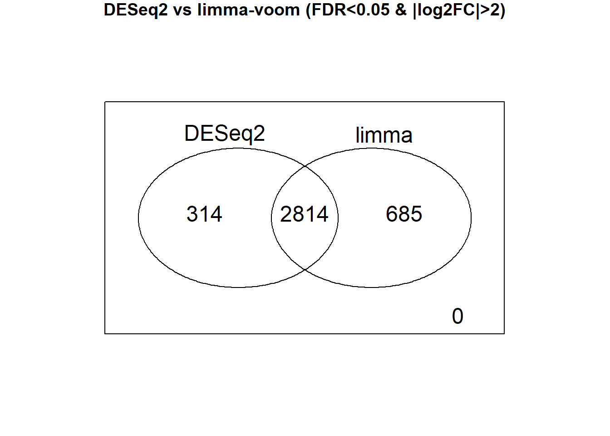
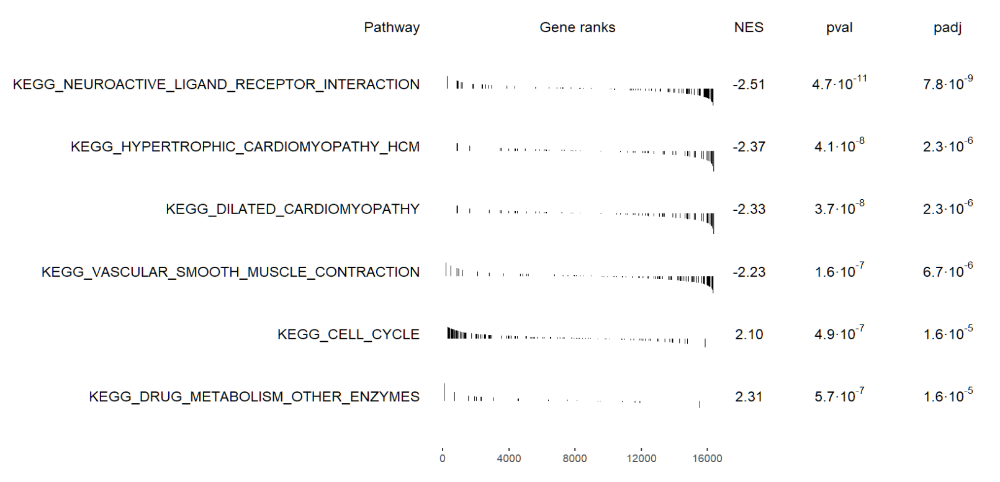
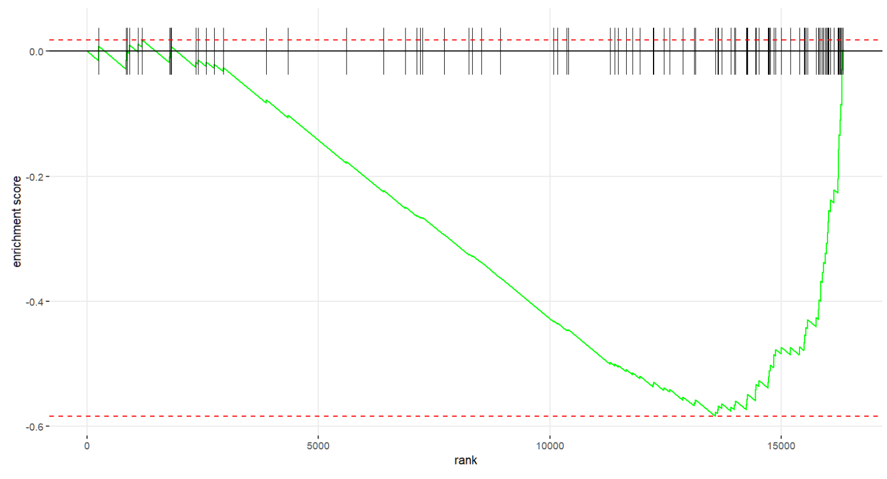

# Introduction
Lung adenocarcinoma (LUAD) is the most common histologic subtype of lung cancer and remains a leading cause of cancer-related mortality worldwide, driven by complex molecular alterations that extend beyond single gene mutations to coordinated dysregulation of transcriptional programs and regulatory networks. Large-scale transcriptomic resources such as The Cancer Genome Atlas (TCGA) and the Genotype-Tissue Expression (GTEx) project provide a unique opportunity to systematically compare tumor and normal lung tissue at the genome-wide expression level and to interrogate mechanisms underlying malignant transformation. 

While prior studies have identified recurrent oncogenic pathways and driver genes in LUAD, less is understood about how transcription factor–target interactions are globally rewired in cancer relative to normal lung tissue. In this study, we propose an integrative comparative transcriptomic and network-based analysis of TCGA LUAD and GTEx normal lung samples to characterize differential gene expression patterns, pathway enrichment, and transcriptional regulatory architecture. By combining dimensionality reduction, differential expression analysis, gene set enrichment, and PANDA-based network inference, this work aims to identify key dysregulated pathways and transcription factors that jointly distinguish LUAD from normal lung tissue and provide insight into the regulatory mechanisms underlying lung tumorigenesis

# Methods

## A. Exploratory Data Analysis 

TCGA lung adenocarcinoma (LUAD) and GTEx normal lung RNA-seq datasets were integrated into a unified ExpressionSet after harmonizing gene identifiers and sample metadata. Genes were filtered to retain those expressed at TPM > 1 in at least 20% of samples and with raw counts > 10 in at least 50% of samples. Clinical covariates were harmonized across datasets, and only standardized variables (dataset, sex, age category, smoking status, and histology) were retained for analysis.
Principal component analysis (PCA) was performed on log-transformed expression values before and after limma-based batch correction to assess global transcriptional structure and residual cohort effects. Dataset associations with principal components were evaluated using correlation and ANOVA. PCA results were visualized with samples colored by dataset and clinical covariates.
Genes contributing most strongly to the first principal component after batch correction were identified by ranking absolute loadings. Hierarchical clustering was conducted on Z-score–scaled expression data using correlation-based distances and average linkage, and results were visualized with annotated heatmaps. Additionally, highly variable genes were selected using median absolute deviation for annotated clustering. Unsupervised k-means clustering was performed on the leading principal components to identify transcriptionally distinct sample groups.

## B. Differential Expression Analysis
We conducted differential expression analysis (DEA) using DESeq2, modeling gene expression as a function of disease status while adjusting for age (categories in 10-year increase) and sex (male vs. female) as covariates. Smoking status was not included in the regression model because this information was available only for tumor samples and not for controls. Individuals with missing age or sex information (n = 20) were excluded from the analysis. Resulting p-values were adjusted for multiple testing using the Benjamini–Hochberg false discovery rate (FDR) procedure. Shrinkage of log fold changes at low expression levels was applied to reduce variability among lowly expressed genes, while preserving strong signals among significantly DEGs. As a sensitivity analysis, we additionally performed DEA using limma-voom and compared the identified differentially expressed genes (DEGs) with those obtained from DESeq2.

## C. Differential Expression Gene PCA and Clustering analysis 
Differentially expressed genes (DEGs) between TCGA LUAD and GTEx normal lung samples were identified using a covariate-adjusted negative binomial model. PCA was performed on normalized expression values restricted to the DEG set to assess improvement in tumor–normal separation. Unsupervised hierarchical and k-means clustering were applied to Z-score–scaled DEG expression to characterize transcriptional heterogeneity among samples.

## D.  GSEA 
Gene Set Enrichment Analysis (GSEA) was performed using genes ranked by differential expression statistics between TCGA LUAD and GTEx normal lung samples. Curated gene sets from MSigDB Hallmark and KEGG collections were used to identify biological pathways enriched in tumor versus normal tissue. Enrichment significance was assessed using permutation-based testing, and multiple testing was controlled using false discovery rate (FDR) correction.

## E. Regulatory Network Inference Using PANDA
To characterize transcriptional regulatory architecture in lung adenocarcinoma and normal lung tissue, we inferred gene regulatory networks using PANDA (Passing Attributes between Networks for Data Assimilation). PANDA integrates three complementary data layers: (i) gene expression profiles, (ii) transcription factor (TF)–gene motif prior information, and (iii) protein–protein interaction (PPI) data among transcription factors. This framework enables estimation of condition-specific regulatory interactions while leveraging prior biological knowledge.

Gene expression data were first harmonized across LUAD (TCGA) and normal lung (GTEx) samples. After gene filtering and batch-effect correction, PANDA networks were inferred separately for LUAD and GTEx using identical motif and PPI priors to ensure comparability. Each PANDA network represents a weighted bipartite graph, where nodes correspond to TFs and target genes, and edge weights (force scores) reflect the inferred strength of regulatory support for each TF–gene interaction.

To quantify differences in regulatory architecture between tumor and normal tissue, we compared corresponding TF–gene edges between the LUAD and GTEx networks. For each shared TF–gene pair, a differential targeting score was computed as the difference in edge weight between the two conditions (LUAD minus GTEx). Positive values indicate increased regulatory targeting in LUAD, whereas negative values indicate stronger targeting in normal lung tissue.

At the transcription factor level, we summarized regulatory rewiring by computing the mean targeting strength of each TF across all its target genes in both networks. Transcription factors were ranked by the absolute difference in mean targeting between LUAD and GTEx, identifying regulators with the largest shifts in regulatory influence. Network-level differences were visualized using differential targeting plots and focused network subgraphs highlighting the most strongly rewired TF–gene interactions.

## F. Identification of Differentially Targeting Transcription Factors and Functional Pathways

Using the PANDA-inferred regulatory networks, we next identified transcription factors exhibiting the largest condition-specific changes in regulatory targeting between LUAD and normal lung tissue. Top differentially targeting TFs were selected based on the absolute change in their mean edge weights across conditions.

For each selected TF, we defined a TF-specific differential targeting profile by calculating gene-level differences in TF–gene edge weights (LUAD minus GTEx). Genes were ranked according to these signed differential targeting scores, capturing whether a TF preferentially increased or decreased regulatory influence on specific targets in LUAD.

To functionally characterize these rewired regulatory programs, we performed secondary gene set enrichment analysis (GSEA) using the ranked gene lists for each TF. KEGG canonical pathways were used as gene sets, and enrichment analysis was conducted using the fgsea framework. This approach identifies biological pathways whose member genes are collectively more strongly or weakly targeted by a given TF in LUAD relative to normal lung tissue.

To account for multiple hypothesis testing across TFs and pathways, p-values were adjusted using the Benjamini–Hochberg false discovery rate (FDR) procedure. Significant TF–pathway associations were summarized using heatmaps and bubble plots, enabling visualization of pathway-level regulatory shifts across multiple TFs.

Together, this network-based framework allowed us to link transcriptional regulatory rewiring to functional pathway alterations, providing insight into how changes in TF targeting contribute to LUAD pathogenesis beyond differential gene expression alone.

## G. Deep Dive Into One Key Gene

To illustrate how regulatory network rewiring identified by PANDA manifests at the level of individual genes, we conducted a focused gene-centric analysis using EGFR, a well-established oncogene in lung adenocarcinoma. EGFR was selected based on its known biological relevance in LUAD and its involvement in signaling pathways identified in the network-level analyses.

First, the Ensembl identifier corresponding to EGFR was obtained by mapping Ensembl gene IDs to official gene symbols using gene annotation metadata from the harmonized expression dataset. PANDA-derived TF–gene edges targeting EGFR were then extracted separately from the LUAD and GTEx regulatory networks.For each transcription factor targeting EGFR, we quantified regulatory rewiring by computing the difference in edge weights between the two networks (LUAD minus GTEx). These TF-specific differential targeting scores capture gains or losses of regulatory influence on EGFR in tumor tissue relative to normal lung. Transcription factors were ranked by the absolute magnitude of this difference to identify those exhibiting the strongest rewiring with respect to EGFR regulation.

External biological annotation was incorporated to contextualize these findings. Public databases, including NCBI Gene and the UCSC Genome Browser, were used to summarize EGFR gene structure, known regulatory features, and functional roles in cancer. These annotations were integrated with PANDA-based results to provide a mechanistic interpretation of how altered transcription factor targeting may contribute to EGFR-driven oncogenic signaling in lung adenocarcinoma.

# Analysis and Results

## A. Exploratory Data Analysis 

### Project Setup
This code accesses a shared Google Drive folder using the googledrive package, lists all files within the folder, creates a local data directory, and downloads each file into that directory using its original filename, overwriting existing files to ensure reproducibility.

```{r, warning=FALSE, message=FALSE, eval=FALSE}
library(googledrive)

folder_url <- "https://drive.google.com/drive/folders/1RMBPLA1wzeKKzQLEUs8drSFNixa4W2fk"
folder_drib <- drive_get(as_id(folder_url))
files_list <- drive_ls(folder_drib)

dir.create("data")

# Download each file into data/
for (i in seq_len(nrow(files_list))) {
  drive_download(
    file = files_list$id[i],
    path = file.path("data", files_list$name[i]),
    overwrite = TRUE
  )
}
```

### Dataset Loading
This code loads the required Bioconductor packages and defines a helper function to convert SummarizedExperiment objects into ExpressionSet objects for downstream analysis. The make_eset() function extracts expression matrices (log-transformed TPM and raw counts) from the assay data and combines them with sample-level metadata (phenoData) and gene-level annotations (featureData). Using this function, the TCGA lung adenocarcinoma and GTEx normal lung RNA-seq datasets are loaded from disk and converted into ExpressionSet objects, providing a standardized data structure compatible with legacy Bioconductor workflows such as limma, PCA, and clustering analyses.
```{r, warning=FALSE, message=FALSE, eval=FALSE}
library(SummarizedExperiment)
library(Biobase)
library(limma)
library(biomaRt)
library(ggfortify)

#Write a function to help convert from summarize experiement files to eset files 

make_eset <- function(se) {
  ExpressionSet(
    assayData = assayDataNew(
      exprs   = as.matrix(assay(se, "logtpm")),
      counts  = as.matrix(assay(se, "raw_counts")),
      log_tpm = as.matrix(assay(se, "logtpm"))
    ),
    phenoData   = AnnotatedDataFrame(as.data.frame(colData(se))),
    featureData = AnnotatedDataFrame(as.data.frame(rowData(se)))
  )
}

#Load TCGA lung adenocarcinoma file and create an eset dataset
#Load GTEX normal lung tissue file and create an eset dataset
luad       <- readRDS("data/tcga_luad.rds")
gtex_lung  <- readRDS("data/gtex_lung.rds")
eset_luad <- make_eset(luad)
eset_gtex <- make_eset(gtex_lung)
```

### Dataset Harmonization
This code harmonizes feature‐level and sample‐level metadata between the TCGA LUAD and GTEx lung ExpressionSet objects by aligning column names and filling missing fields with NA. It then restricts both datasets to their shared set of genes, labels samples by dataset of origin, and combines expression matrices, counts, and metadata into a single unified ExpressionSet for downstream integrative analysis.

```{r, warning=FALSE, message=FALSE, eval=FALSE}
harmonize_cols <- function(df1, df2) {
  all_cols <- union(colnames(df1), colnames(df2))
  df1[setdiff(all_cols, colnames(df1))] <- NA
  df2[setdiff(all_cols, colnames(df2))] <- NA
  list(df1 = df1[, all_cols], df2 = df2[, all_cols])
}

# fData
fd <- harmonize_cols(fData(eset_luad), fData(eset_gtex))
fData(eset_luad) <- fd$df1
fData(eset_gtex) <- fd$df2

# pData
pd <- harmonize_cols(pData(eset_luad), pData(eset_gtex))
pData(eset_luad) <- pd$df1
pData(eset_gtex) <- pd$df2

#common genes
common_genes <- intersect(rownames(eset_luad), rownames(eset_gtex))
eset_luad <- eset_luad[common_genes, ]
eset_gtex <- eset_gtex[common_genes, ]

pData(eset_luad)$dataset <- "TCGA_LUAD"
pData(eset_gtex)$dataset <- "GTEX_LUNG"

combined_eset <- ExpressionSet(
  assayData = assayDataNew(
    exprs   = cbind(exprs(eset_luad), exprs(eset_gtex)),
    counts  = cbind(assayData(eset_luad)$counts,
                    assayData(eset_gtex)$counts),
    log_tpm = cbind(assayData(eset_luad)$log_tpm,
                    assayData(eset_gtex)$log_tpm)
  ),
  phenoData   = AnnotatedDataFrame(rbind(pData(eset_luad),
                                         pData(eset_gtex))),
  featureData = AnnotatedDataFrame(fData(eset_luad))
)
```

### Count filtering

This code converts log-transformed TPM values back to the original TPM scale, retrieves raw read counts, and filters genes based on expression prevalence and abundance. Genes are retained if they are expressed at TPM > 1 in at least 20% of samples and have counts > 10 in at least 50% of samples. The filtered gene set is then used to subset the combined ExpressionSet, producing a cleaner dataset for downstream analyses.

```{r, warning=FALSE, message=FALSE, eval=FALSE}
tpm <- 2^(assayData(combined_eset)$log_tpm) - 1
counts <- assayData(combined_eset)$counts

keep_genes <-
  rowMeans(tpm > 1)     >= 0.20 &
  rowMeans(counts > 10) >= 0.50

filtered_eset <- combined_eset[keep_genes, ]
dim(filtered_eset)
```
## Extracting Covariates of Interest
This code harmonizes key clinical covariates across TCGA LUAD and GTEx lung samples. Age information from TCGA (continuous) and GTEx (categorical) is recoded into a common ordered age category variable, while sex is standardized across datasets. Tumor histology is assigned for TCGA samples with normal tissue labeled accordingly, and smoking status is collapsed into consistent categories (Never, Ever, Missing). The cleaned and harmonized clinical variables are then retained and reassigned to the filtered ExpressionSet for downstream adjusted analyses.
```{r, warning=FALSE, message=FALSE, eval=FALSE}
pd <- pData(filtered_eset)

#Harmonize age categories
table(pd$gtex.age)
table(pd$tcga.cgc_case_age_at_diagnosis)
sum(is.na(pd$gtex.age))
sum(is.na(pd$tcga.cgc_case_age_at_diagnosis))

age_levels <- c("20-29","30-39","40-49","50-59","60-69","70-79","80-89")
tcga_age <- suppressWarnings(as.numeric(pd$tcga.cgc_case_age_at_diagnosis))
tcga_bins <- cut(
  tcga_age,
  breaks = c(20, 30, 40, 50, 60, 70, 80, 90),
  labels = age_levels,
  right = FALSE
)
gtex_bins <- as.character(pd$gtex.age)
gtex_bins[!gtex_bins %in% age_levels] <- NA
pd$age_cat <- NA_character_
pd$age_cat[pd$dataset == "TCGA_LUAD"] <- as.character(tcga_bins[pd$dataset == "TCGA_LUAD"])
pd$age_cat[pd$dataset == "GTEX_LUNG"] <- gtex_bins[pd$dataset == "GTEX_LUNG"]
pd$age_cat <- factor(pd$age_cat, levels = age_levels, ordered = TRUE)
table(pd$age_cat, pd$dataset, useNA = "ifany")
table(pd$age_cat)

#Harmonize sex categories
pd$sex <- NA
pd$sex[pd$tcga.cgc_case_gender == "MALE"]   <- "Male"
pd$sex[pd$tcga.cgc_case_gender == "FEMALE"] <- "Female"
pd$sex[pd$gtex.sex == 1] <- "Male"
pd$sex[pd$gtex.sex == 2] <- "Female"
pd$sex <- factor(pd$sex, levels = c("Male", "Female"))
table(pd$sex)

#Harmonize histology categories
pd$hist_type <- pd$tcga.xml_histological_type
pd$hist_type[is.na(pd$hist_type)] <- "Normal"
pd$hist_type <- factor(pd$hist_type)
table(pd$hist_type)

#Harmonize smoking status 
pd$smoking <- NA
pd$smoking[pd$tcga.xml_tobacco_smoking_history == 1] <- "Never"
pd$smoking[pd$tcga.xml_tobacco_smoking_history %in% 2:6] <- "Ever"
pd$smoking[
  is.na(pd$tcga.xml_tobacco_smoking_history) |
  pd$tcga.xml_tobacco_smoking_history == 7
] <- "Missing"
pd$smoking <- factor(pd$smoking, levels = c("Missing","Never","Ever"))
table(pd$smoking)

pd_clean <- pd[, c("dataset","sex","age_cat","smoking","hist_type")]
pData(filtered_eset) <- pd_clean
```

## Panda input Fix
This code prepares batch-corrected expression data for PANDA network inference by aligning expression matrices with sample metadata, resolving identifier mismatches, and exporting properly formatted input files. Samples are first matched to the filtered ExpressionSet metadata to correctly subset LUAD and GTEx samples and avoid indexing errors. Ensembl gene IDs are then cleaned by removing version numbers to ensure compatibility with PANDA. Finally, the corrected expression matrices are reformatted into tab-delimited files with gene IDs as the first column and samples as columns, producing finalized LUAD and GTEx expression files suitable for downstream regulatory network analysis.
```{r, warning=FALSE, message=FALSE, eval=FALSE}
library(Biobase) 
logtpm <- exprs(filtered_eset)
batch <- pData(filtered_eset)$dataset   # “TCGA_LUAD” / “GTEx_Lung”
logtpm_corrected <- removeBatchEffect(
  logtpm,                   # or logtpm if not quantile normalized
  batch = batch
)
corrected_sample_ids <- colnames(logtpm_corrected)
metadata_matched <- pData(filtered_eset)[corrected_sample_ids, ]
luad_samples_final <- metadata_matched$dataset == "TCGA_LUAD"
gtex_samples_final <- metadata_matched$dataset == "GTEX_LUNG"
luad_corrected_expr <- logtpm_corrected[, luad_samples_final]
gtex_corrected_expr <- logtpm_corrected[, gtex_samples_final]
rownames(luad_corrected_expr) <- sub("\\..*", "", rownames(luad_corrected_expr))
rownames(gtex_corrected_expr) <- sub("\\..*", "", rownames(gtex_corrected_expr))
luad_panda_df <- as.data.frame(luad_corrected_expr)
luad_panda_df$ID <- rownames(luad_panda_df)
luad_panda_df <- luad_panda_df[, c(ncol(luad_panda_df), 1:(ncol(luad_panda_df)-1))] 
write.table(
  luad_panda_df,
  file = "luad_corrected_expression_final.txt",
  sep = "\t",
  quote = FALSE,
  row.names = FALSE # Ensure R's internal row names are not written
)
gtex_panda_df <- as.data.frame(gtex_corrected_expr)
gtex_panda_df$ID <- rownames(gtex_panda_df)
gtex_panda_df <- gtex_panda_df[, c(ncol(gtex_panda_df), 1:(ncol(gtex_panda_df)-1))]

write.table(
  gtex_panda_df,
  file = "gtex_corrected_expression_final.txt",
  sep = "\t",
  quote = FALSE,
  row.names = FALSE
)
gtex_panda_df_fixed <- data.frame(
  ID = rownames(gtex_corrected_expr),
  as.data.frame(gtex_corrected_expr) 
)
write.table(
  gtex_panda_df_fixed,
  file = "gtex_corrected_expression_final.txt",
  sep = "\t",
  quote = FALSE,
  row.names = FALSE
)
```

## Principle Component Analysis
This code performs principal component analysis (PCA) on the filtered LUAD–GTEx expression dataset before and after batch correction using log-TPM and normalized log-TPM values, respectively. It visualizes the first two principal components colored by dataset to assess batch effects and correction effectiveness, annotating each axis with the variance explained. Finally, the processed ExpressionSet is saved to disk for downstream analyses.
```{r, warning=FALSE, message=FALSE, eval=FALSE}
library(ggfortify)
library(limma)
library(ggplot2)
# PCA before batch correction
PCA_filter_prebatch <- prcomp(t(assayData(filtered_eset)[["counts"]]))
# PCA after batch correction
PCA_filter_postbatch <- prcomp(t(assayData(filtered_eset)[["log_tpm"]]))


#autoplot(PCA_filter_prebatch, data=pData(filtered_eset), colour="study",
#         main="Before batch correction")
study <- pData(filtered_eset)$dataset 

#plotting PCA pre and post batch correction for tcga / gtex dataset with base r
plot(
  PCA_filter_prebatch$x[,1], PCA_filter_prebatch$x[,2],
  col = as.factor(study),
  pch = 19,
  xlab = paste0("PC1 (", round(summary(PCA_filter_prebatch)$importance[2,1] * 100, 1), "%)"),
  ylab = paste0("PC2 (", round(summary(PCA_filter_prebatch)$importance[2,2] * 100, 1), "%)"),
  main = "PCA Before Batch Correction"
)
legend("topright", legend = levels(as.factor(study)),
       col = 1:length(levels(as.factor(study))), pch = 19)

plot(
  PCA_filter_postbatch$x[,1], PCA_filter_postbatch$x[,2],
  col = as.factor(study),
  pch = 19,
  xlab = paste0("PC1 (", round(summary(PCA_filter_postbatch)$importance[2,1] * 100, 1), "%)"),
  ylab = paste0("PC2 (", round(summary(PCA_filter_postbatch)$importance[2,2] * 100, 1), "%)"),
  main = "PCA After Batch Correction"
)
legend("topright", legend = levels(as.factor(study)),
       col = 1:length(levels(as.factor(study))), pch = 19)

saveRDS(filtered_eset, file = "luad_gtex_eset_1207.rds")
##
#filtered_eset <- readRDS("luad_gtex_eset_1207.rds")
```


```{r, warning=FALSE, message=FALSE, eval=FALSE}
pc_pre  <- PCA_filter_prebatch$x[,1]
pc_post <- PCA_filter_postbatch$x[,1]

batch_num <- as.numeric(factor(study))

cor(pc_pre, batch_num, use = "complete.obs")
cor(pc_post, batch_num, use = "complete.obs")

summary(aov(pc_pre ~ study))
summary(aov(pc_post ~ study))

summary(PCA_filter_prebatch)$importance[2, 1:2]
summary(PCA_filter_postbatch)$importance[2, 1:2]

head(sort(abs(PCA_filter_postbatch$rotation[,1]), decreasing = TRUE), 10)

pc1_loadings <- PCA_filter_postbatch$rotation[, 1]
fd <- fData(filtered_eset)

gene_map <- data.frame(
  gene_id   = rownames(fd),
  gene_name = fd$gene_name,
  stringsAsFactors = FALSE
)
pc1_table <- data.frame(
  gene_id = names(pc1_loadings),
  explainable_variance_for_PC1 = pc1_loadings,
  abs_loading = abs(pc1_loadings),
  stringsAsFactors = FALSE
)

pc1_table <- merge(pc1_table, gene_map, by = "gene_id", all.x = TRUE)
head(
  pc1_table[order(pc1_table$abs_loading, decreasing = TRUE),
            c("gene_id", "gene_name", "explainable_variance_for_PC1")],
  10
)
```

```{r, warning=FALSE, message=FALSE, eval=FALSE}
tissue <- pData(filtered_eset)$hist_type

plot(PCA_filter_postbatch$x[,1], PCA_filter_postbatch$x[,2],
     col = as.factor(tissue), pch = 19,
     xlab = "PC1", ylab = "PC2",
     main = "PCA by Tissue Histological Type")
legend(
  "topright",
  legend = levels(as.factor(tissue)),
  col = seq_along(levels(as.factor(tissue))),
  pch = 19,
  bty = "n",
  horiz = FALSE,
  cex = 0.5,
  pt.cex = 0.5
)
```

```{r, warning=FALSE, message=FALSE, eval=FALSE}
sex <- pData(filtered_eset)$sex
plot(
  PCA_filter_postbatch$x[,1], PCA_filter_postbatch$x[,2],
  col = as.factor(sex),
  pch = 19,
  xlab = "PC1",
  ylab = "PC2",
  main = "PCA After Batch Correction (by Sex)"
)

legend(
  "bottom",
  legend = levels(as.factor(sex)),
  col = seq_along(levels(as.factor(sex))),
  pch = 19,
  bty = "n",
  horiz = TRUE,
  cex = 0.6,
  pt.cex = 0.6
)
```

```{r, warning=FALSE, message=FALSE, eval=FALSE}
age_cat <- pData(filtered_eset)$age_cat

plot(
  PCA_filter_postbatch$x[,1], PCA_filter_postbatch$x[,2],
  col = as.factor(age_cat),
  pch = 19,
  xlab = "PC1",
  ylab = "PC2",
  main = "PCA After Batch Correction (by Age Category)"
)

legend(
  "bottom",
  legend = levels(age_cat),
  col = seq_along(levels(age_cat)),
  pch = 19,
  bty = "n",
  horiz = TRUE,
  cex = 0.55,
  pt.cex = 0.55
)
```
## Clustering Analysis 

### Hierrchical clustering

```{r, warning=FALSE, message=FALSE}
library(Biobase)
library(pheatmap)
library(SummarizedExperiment)
library(dendextend)
```

Genes with zero variance across samples were excluded.
Hierarchical clustering was performed using average linkage.
Expression values were Z-score standardized across samples prior to clustering.
```{r, warning=FALSE, message=FALSE, eval=FALSE}
### 1. Extract expression matrix
expr_mat <- assayData(filtered_eset)[["log_tpm"]]

# Drop zero-variance genes
expr_mat <- expr_mat[apply(expr_mat, 1, var) > 0, ]

# Assign gene names safely
gene_names <- fData(filtered_eset)$gene_name
if (length(gene_names) == nrow(expr_mat)) {
  rownames(expr_mat) <- make.unique(gene_names)
} else {
  warning("gene_name length mismatch; using featureNames instead")
  rownames(expr_mat) <- featureNames(filtered_eset)
}

### 2. Z-score scaling across samples (gene-wise)
expr_scaled <- t(scale(t(expr_mat)))
expr_scaled <- expr_scaled[complete.cases(expr_scaled), ]

### 3. Distance matrices
dist_samples <- as.dist(1 - cor(expr_scaled, method = "spearman"))
dist_genes   <- as.dist(1 - cor(t(expr_scaled), method = "pearson"))

### 4. Hierarchical clustering (use ONE method consistently)
hc_samples <- hclust(dist_samples, method = "average")
hc_genes   <- hclust(dist_genes,   method = "average")

### 5. Sample annotation
annotation_col <- data.frame(
  Dataset = pData(filtered_eset)$dataset
)
rownames(annotation_col) <- colnames(expr_scaled)

ann_colors <- list(
  Dataset = c(
    TCGA_LUAD = "#D55E00",
    GTEX_LUNG = "#0072B2"
  )
)
```

```{r, warning=FALSE, message=FALSE, eval=FALSE}
### 6. Heatmap (precomputed clustering)
pheatmap(
  expr_scaled,
  cluster_rows = hc_genes,
  cluster_cols = hc_samples,
  annotation_col = annotation_col,
  annotation_colors = ann_colors,
  show_rownames = FALSE,
  show_colnames = FALSE,
  fontsize_col = 8,
  main = "Hierarchical Clustering: LUAD vs GTEx",
  clustering_distance_rows = dist_genes,
  clustering_distance_cols = dist_samples
)
```


```{r, warning=FALSE, message=FALSE, eval=FALSE}
colnames(pData(filtered_eset))
pd <- pData(filtered_eset)

pd$sex       <- factor(pd$sex)
pd$age_cat   <- factor(pd$age_cat)
pd$smoking   <- factor(pd$smoking)
pd$hist_type <- factor(pd$hist_type)
pd$dataset   <- factor(pd$dataset)
#expr <- assayData(filtered_eset)[["norm_logtpm"]]
mad_vals <- apply(expr, 1, mad)
top_genes <- names(sort(mad_vals, decreasing = TRUE))[1:50]
expr_top <- expr[top_genes, ]
expr_scaled <- t(scale(t(expr_top)))
annotation_col <- pd[, c("dataset", "sex", "age_cat", "smoking", "hist_type")]
rownames(annotation_col) <- colnames(expr_scaled)

pheatmap(
  expr_scaled,
  annotation_col = annotation_col,
  show_rownames = FALSE,
  show_colnames = FALSE,
  clustering_distance_cols = "correlation",
  clustering_method = "average",
  main = "Hierarchical clustering with clinical annotations"
)

```

```{r, warning=FALSE, message=FALSE, eval=FALSE}
expr <- assayData(filtered_eset)[["log_tpm"]]

# All genes by MAD
mad_vals <- apply(expr, 1, mad)
top_genes <- names(sort(mad_vals, decreasing = TRUE))

expr_top <- expr[top_genes, ]
expr_scaled <- t(scale(t(expr_top)))
expr_scaled <- expr_scaled[complete.cases(expr_scaled), ]
pca <- prcomp(t(expr_scaled), center = TRUE, scale. = FALSE)
summary(pca)$importance[3, ]
pc_mat <- pca$x[, 1:10]

set.seed(123)
wss <- sapply(2:8, function(k) {
  kmeans(pc_mat, centers = k, nstart = 50)$tot.withinss
})
plot(2:8, wss, type = "b",
     xlab = "Number of clusters (K)",
     ylab = "Total within-cluster sum of squares")
```

```{r, warning=FALSE, message=FALSE, eval=FALSE}
luad_idx <- pd$dataset == "TCGA_LUAD"

pca_luad <- prcomp(t(expr_scaled[, luad_idx]))

autoplot(
  pca_luad,
  data = pd[luad_idx, ],
  colour = "hist_type",
  shape  = "smoking"
) +
  theme_classic() +
  labs(title = "LUAD transcriptional heterogeneity by histology and smoking")

```

```{r, warning=FALSE, message=FALSE, eval=FALSE}
set.seed(123)
km_res <- kmeans(pc_mat, centers = 3, nstart = 100)

cluster_assignments <- factor(km_res$cluster)
pd <- pData(filtered_eset)
pd$kmeans_cluster <- cluster_assignments
library(ggplot2)

pca_df <- data.frame(
  PC1 = pc_mat[,1],
  PC2 = pc_mat[,2],
  cluster = pd$kmeans_cluster,
  dataset = pd$dataset,
  hist_type = pd$hist_type
)

ggplot(pca_df, aes(PC1, PC2, color = cluster, shape = dataset)) +
  geom_point(size = 3, alpha = 0.8) +
  theme_classic() +
  labs(title = "k-means clustering of RNA-seq samples")
```

```{r, warning=FALSE, message=FALSE, eval=FALSE}
table(pd$kmeans_cluster, pd$hist_type)
table(pd$kmeans_cluster, pd$smoking)
chisq.test(table(pd$kmeans_cluster, pd$hist_type))

```

# **B. Differential Expression analysis**


Results:

After applying for shrinkage of log fold change and corrected for multiple testing, around 3,400 genes were found to be differentially expressed in DESeq2 that passed the threshold of adjusted p value < 0.05 and a log fold change > 2. This substantial number of genes show pronounced positive or negative log fold changes, distributed across a wide range of expression levels. Greater variability in log fold change is observed among genes with lower to moderate expression, whereas highly expressed genes exhibit more stable estimates. Overall, the symmetric distribution of up- and down-regulated genes suggests balanced differential expression between conditions.
```{r}
knitr::include_graphics("figures/MA_DESeq2.png")
```

Both DESeq2 and limma-voom yielded broadly comparable results, with approximately 80% of DEGs identified by both methods. Among these shared DEGs, the Spearman correlation coefficient for log fold-change estimates was 0.98, indicating strong concordance between the two approaches.
```{r}
knitr::include_graphics("figures/MA_limma.png")
```

```{r}

```

The top 20 differentially expressed genes (DEGs) are shown below, with most exhibiting stronger up-regulation in tumor tissues compared with normal tissues. A majority of these genes were pseudogenes or long non-coding RNAs (lncRNAs). Based on functional annotation from GeneCards, several of the top DEGs are implicated in lung-related pathophysiology, including asthma (PPIAP6) and expiratory flow (HNRNPA1P8).
```{r}
knitr::include_graphics("figures/top20genes.png")
```

# **C. PCA and clustering analysis**

Results: 

PCA based on DEGs (adjusted P < 0.05 and |log₂ fold change| > 2) demonstrated clear separation along the first two principal components, markedly improving discrimination compared with the global PCA. PC1 alone explained up to 56% of the total variance. Minimal overlap was observed between tumor and normal tissues, indicating strong underlying biological separation.

```{r}
knitr::include_graphics("figures/PCA_DEG.png")
```

To further characterize DEG expression patterns, unsupervised clustering was performed. Based on the within-cluster sum of squares (WSS) plot, four clusters were selected. Two clusters corresponded to tumor tissues and two to normal tissues, again demonstrating strong separation and distinct clustering between the two tissue types.

```{r}
knitr::include_graphics("figures/k-means.png")
```

```{r}
knitr::include_graphics("figures/cluster_DEGs.png")
```


## Differential Expression Analysis 

```{r, warning=FALSE, message=FALSE, eval=FALSE}
#if (!requireNamespace("BiocManager", quietly = TRUE))
#    install.packages("BiocManager")
#BiocManager::install("rnaseqGene", version = "3.8")
#BiocManager::install("DESeq2")
library(DESeq2) # for RNA-seq analysis
library(dplyr) # for data processing
library(magrittr)
library(apeglm) # Used by DESeq2 to fit a linear model
library(ggplot2) # for visualization
library(vsn) # for variance stabilization
library(hexbin) # for visualization
BiocManager::install("edgeR")
library(edgeR)
library(gplots)
library(Biobase)
library(limma)

#Load
filtered_eset <- readRDS("luad_gtex_eset_1207.rds")
#investigate
filtered_eset
# Extract counts and sample metadata
countdata <- assayData(filtered_eset)$counts   # genes x samples
coldata   <- pData(filtered_eset)             # samples x variables

# Create a group variable: normal (GTEx) vs tumor (TCGA)
coldata$group <- ifelse(coldata$dataset == "TCGA_LUAD", "tumor", "normal")
coldata$group <- factor(coldata$group, levels = c("normal", "tumor"))
table(coldata$group)
```

```{r, warning=FALSE, message=FALSE, eval=FALSE}
# Extract counts and metadata
countdata <- assayData(filtered_eset)$counts
coldata   <- as.data.frame(pData(filtered_eset))

# Define tumor vs normal
coldata$group <- factor(
  ifelse(coldata$dataset == "TCGA_LUAD", "tumor", "normal"),
  levels = c("normal", "tumor")
)

# Harmonize sex
coldata$sex <- ifelse(
  coldata$dataset == "GTEX_LUNG",
  ifelse(coldata$gtex.sex == 1, "MALE", "FEMALE"),
  coldata$tcga.cgc_case_gender
)
coldata$sex <- factor(coldata$sex, levels = c("FEMALE", "MALE"))

# Harmonize age bins
age_levels <- c("20-29","30-39","40-49","50-59","60-69","70-79","80-89")
tcga_bins <- cut(
  coldata$tcga.cgc_case_age_at_diagnosis,
  breaks = c(20,30,40,50,60,70,80,90),
  labels = age_levels,
  right = FALSE
)

coldata$age_bin <- factor(
  ifelse(coldata$dataset == "GTEx_LUNG", coldata$gtex.age, as.character(tcga_bins)),
  levels = age_levels
)

# Keep complete cases for design variables
design_vars <- c("sex", "age_bin", "group")
keep <- complete.cases(coldata[, design_vars])

coldata_filt   <- coldata[keep, ]
countdata_filt <- countdata[, keep]
stopifnot(all(colnames(countdata_filt) == rownames(coldata_filt)))

# Table 1 summaries
table(coldata_filt$dataset, coldata_filt$sex)
table(coldata_filt$dataset, coldata_filt$age_bin)

# Numeric age summary
bin_medians <- c("20-29"=25,"30-39"=35,"40-49"=45,"50-59"=55,
                 "60-69"=65,"70-79"=75,"80-89"=85)

coldata_filt$age_num <- bin_medians[as.character(coldata_filt$age_bin)]

age_summary_by_group <- coldata_filt |>
  dplyr::group_by(group) |>
  dplyr::summarise(
    n = sum(!is.na(age_num)),
    mean_age = mean(age_num, na.rm = TRUE),
    sd_age = sd(age_num, na.rm = TRUE)
  )

knitr::kable(age_summary_by_group, caption = "Mean (SD) Age by Tumor Status")

dds <- DESeqDataSetFromMatrix(
  countData = round(countdata_filt),
  colData   = coldata_filt,         
  design    = ~ sex + age_cat + group
)

dds
nrow(dds)
saveRDS(dds, file = "data/dds.rds") # export for Emily
```
# DESeq2
## Pre-filtering datasets

```{r, warning=FALSE, message=FALSE, eval=FALSE}
library("vsn") # for variance stabilization
library("hexbin") # for visualization

#rows with 2 or more counts across all samples
dds <- dds[ rowSums(counts(dds)) > 1, ]
nrow(dds)
lambda <- 10^seq(from = -1, to = 2, length = 1000)
cts <- matrix(rpois(1000*100, lambda), ncol = 100)
meanSdPlot(cts, ranks = FALSE)
log.cts.one <- log2(cts + 1)
meanSdPlot(log.cts.one, ranks = FALSE)
```


```{r, warning=FALSE, message=FALSE, eval=FALSE}
#Use the variance stabilizing transformation (VST) for count data that stabilize the variance across the mean: 
vsd <- vst(dds, blind = FALSE)
head(assay(vsd), 3)

dds <- estimateSizeFactors(dds)

df <- bind_rows(
  as_data_frame(log2(counts(dds, normalized=TRUE)[, 1:2]+1)) %>%
         mutate(transformation = "log2(x + 1)"),
  as_data_frame(assay(vsd)[, 1:2]) %>% mutate(transformation = "vst"))
  
colnames(df)[1:2] <- c("x", "y")  
ggplot(df, aes(x = x, y = y)) + geom_hex(bins = 80) +
  coord_fixed() + facet_grid( . ~ transformation) 
```

```{r, eval=FALSE}
dds <- DESeq(dds)
res <- results(dds)
res
summary(res)
```


## Summarizing results

```{r, eval=FALSE}
#raw results
sum(res$pvalue < 0.05, na.rm=TRUE)
sum(!is.na(res$pvalue)) 
```

```{r, eval=FALSE}
#FDR correction
res.05 <- results(dds, alpha = 0.05)
table(res.05$padj < 0.05)
```

```{r, eval=FALSE}
#Raise the log2 fold change threshold to 2
resLFC2 <- results(dds, lfcThreshold=2)
table(resLFC2$padj < 0.05)
```

```{r, eval=FALSE}
sum(res$padj < 0.1, na.rm=TRUE)
resSig <- subset(res, padj < 0.1)

#strongest down-regulation
head(resSig[ order(resSig$log2FoldChange), ])
#strongest up-regulation
head(resSig[ order(-resSig$log2FoldChange), ])
```

## Plotting results

```{r, eval=FALSE}
res.noshr <- results(dds, name="group_tumor_vs_normal")
DESeq2::plotMA(res.noshr, ylim = c(-10, 10))
```

```{r, eval=FALSE}
# A strict threshold that with shrinkage
res_shrunk <- lfcShrink(dds, coef = "group_tumor_vs_normal", type = "apeglm")

res_shrunk_strict <- res_shrunk[
  !is.na(res_shrunk$padj) &
    res_shrunk$padj < 0.05 &
    abs(res_shrunk$log2FoldChange) > 2,
]

DESeq2::plotMA(res_shrunk_strict, ylim = c(-10, 10))
```

```{r, eval=FALSE}
hist(res$pvalue[res$baseMean > 1], breaks = 0:20/20,
     col = "grey50", border = "white",main='P-value histogram')
```

## Export results

```{r, eval=FALSE}
de_genes <- rownames(res)[ which(res$padj < 0.1 & !is.na(res$padj)) ]
length(intersect(de_genes, featureNames(filtered_eset)))

de_eset <- filtered_eset[de_genes, ]

# Add DESeq2 statistics into featureData
de_stats <- as.data.frame(res[de_genes, ])
fData(de_eset) <- cbind(fData(de_eset), de_stats)

nrow(de_eset)        # number of genes
ncol(de_eset)        # number of samples

head(featureNames(de_eset))
head(fData(de_eset)$gene_name)

saveRDS(de_eset, file = "data/DE_genes_only_eset_DESeq2.rds")
```

# Limma-voom

## Analysis

```{r, warning=FALSE, message=FALSE, eval=FALSE}
countdata_filt <- countdata[, keep]
coldata_filt   <- coldata[keep, ]
group          <- coldata_filt$group

y <- DGEList(counts = countdata_filt)

# filtering using the same for DESeq2 pre-filtering
keep_genes2 <- filterByExpr(y, group = group)
y <- y[keep_genes2, , keep.lib.sizes = FALSE]
y <- calcNormFactors(y)

design_limma <- model.matrix(~ sex + age_cat + group, data = coldata_filt)
```

```{r, eval=FALSE}
v <- voom(y, design_limma, plot = TRUE)
fit_limma <- lmFit(v, design_limma)
fit_limma <- eBayes(fit_limma)

res_limma <- topTable(fit_limma, coef = "grouptumor", number = Inf)

topTable(fit_limma, coef = "grouptumor", n = 20)  
```

## Plot results

```{r, eval=FALSE}
plotSA(fit_limma, main="Final model mean-variance trend")
```

## Plotting results

```{r, eval=FALSE}
# Find the number of genes differentially expressed under a defined thereshold (FDR<0.05 and absolute log fold-change greater than 2).
sum(res_limma$adj.P.Val < 0.05 & abs(res_limma$logFC) > 2)
```

```{r, eval=FALSE}
# Find the number of genes overexpressed in the cell lines
sum(res_limma$adj.P.Val < 0.05 & res_limma$logFC > 2)
```

```{r, eval=FALSE}
# Find the number of genes overexpressed in the tissue samples
sum(res_limma$adj.P.Val < 0.05 & res_limma$logFC < -2)
```

```{r, eval=FALSE}
# Volcano-plot
# Color genes differentially expressed under a defined thereshold (FDR<0.05 and absolute log fold-change greater than 2).
sig = ifelse(res_limma$adj.P.Val < 0.05 & abs(res_limma$logFC) > 2, yes="red",no="black")
plot(x=res_limma$logFC, y=-log(res_limma$adj.P.Val), xlab="log-fold-change",
     ylab="-log(FDR)",pch=21,col=sig,bty="l", main="Volcano plot", cex=0.8)
```

```{r, eval=FALSE}
# MA plot
sig = ifelse(res_limma$adj.P.Val < 0.05 & abs(res_limma$logFC) > 2, yes="red",no="black")
plot(x=res_limma$AveExpr, y=res_limma$logFC, xlab="Average log-expression", ylab="log-fold-change",
     pch=21,col=sig,bty="l", main="MA plot", cex=0.8)
```

```{r, message=FALSE, warning=FALSE, eval=FALSE}
# Heatmap with top 20 differentially expressed genes
y <- DGEList(counts = countdata_filt)
y <- calcNormFactors(y)

logcpm0 <- log2(cpm(y) + 1)   # forces min = 0

res_filt <- subset(res_limma, adj.P.Val < 0.05 & abs(logFC) > 2)
top_genes <- rownames(res_filt)[1:20]
#mat <- v$E[top_genes, ]
mat <- logcpm0[top_genes, ]

# Create color bar with group information
cols <- coldata_filt$group
heatmapColColors <- c("blue", "red")[factor(cols)]
# Create a vector for the heatmap color
heatmapCols = colorRampPalette(c("yellow", "red"))(250)
# Plot the heatmap and legend
heatmap.2(
  mat,
  trace = "none",
  ColSideColors = heatmapColColors,
  col = heatmapCols,
  labCol = FALSE,
  margins = c(1, 12),
  density.info = "none",
  key.xlab = "expression", 
  key.title = NA
)

legend(
  "topright",
  legend = levels(factor(cols)),
  fill = c("blue", "red"),
  xpd = TRUE,
  box.lwd = NA
)
```

```{r, eval=FALSE}
# Replace row names by gene symbol
feat <- fData(filtered_eset)
symbol <- feat[rownames(mat), "gene_name"]
heatmap.2(
  mat,
  trace = "none",
  ColSideColors = heatmapColColors,
  col = heatmapCols,
  labCol = FALSE,
  labRow = symbol,
  margins = c(1, 12),
  density.info = "none",
  key.xlab = "expression",
  key.title = NA
)

legend(
  "topright",
  legend = unique(cols),
  fill = unique(heatmapColColors),
  xpd = TRUE,
  box.lwd = NA
)
```

## Export results

```{r, eval=FALSE}
# FDR < 0.1, like with DESeq2
res_limma_sig <- res_limma[res_limma$adj.P.Val < 0.1, ]
nrow(res_limma_sig)  

res_limma_sig$gene_id     <- rownames(res_limma_sig)
res_limma_sig$gene_symbol <- feat[res_limma_sig$gene_id, "gene_name"]  

saveRDS(res_limma_sig, file = "data/DE_genes_limma.rds")
```

# Compare results

## Main results - padj \< 0.1

```{r, eval=FALSE}
sig_deseq <- res[de_genes, ]

common_genes <- intersect(rownames(sig_deseq), rownames(res_limma_sig))
length(common_genes)

cor(sig_deseq[common_genes, "log2FoldChange"],
    res_limma_sig[common_genes, "logFC"],
    use = "complete.obs")
```

```{r, eval=FALSE}
#Venn Diagram
deseq_genes <- rownames(sig_deseq)
limma_genes <- rownames(res_limma_sig)

only_deseq  <- setdiff(deseq_genes, limma_genes)
only_limma  <- setdiff(limma_genes, deseq_genes)
both        <- intersect(deseq_genes, limma_genes)

length(deseq_genes)   # total DESeq2 sig
length(limma_genes)   # total limma sig
length(both)          # overlap
length(only_deseq)    # DESeq2-only
length(only_limma)    # limma-only

all_genes <- union(rownames(res), rownames(res_limma))

venn_mat <- cbind(
  DESeq2 = all_genes %in% deseq_genes,
  limma  = all_genes %in% limma_genes
)
rownames(venn_mat) <- all_genes

vennDiagram(venn_mat, main = "DESeq2 vs limma-voom")
```

## More stringent results - padj \< 0.05 & log2 \> 2

```{r, eval=FALSE}
sig_deseq_strict <- subset(
  res,
  padj < 0.05 & !is.na(padj) & abs(log2FoldChange) > 2
)
nrow(sig_deseq_strict)

res_limma_strict <- subset(
  res_limma,
  adj.P.Val < 0.05 & !is.na(adj.P.Val) & abs(logFC) > 2
)
nrow(res_limma_strict)

deseq_genes_strict <- rownames(sig_deseq_strict)
limma_genes_strict <- rownames(res_limma_strict)

common_genes_strict <- intersect(deseq_genes_strict, limma_genes_strict)
length(common_genes_strict)   

cor(
  sig_deseq_strict[common_genes_strict, "log2FoldChange"],
  res_limma_strict[common_genes_strict, "logFC"],
  use = "complete.obs"
)

all_genes_strict <- union(deseq_genes_strict, limma_genes_strict)

venn_mat_strict <- cbind(
  DESeq2 = all_genes_strict %in% deseq_genes_strict,
  limma  = all_genes_strict %in% limma_genes_strict
)
rownames(venn_mat_strict) <- all_genes_strict

vennDiagram(venn_mat_strict, main = "DESeq2 vs limma-voom (FDR<0.05 & |log2FC|>2)")

```

# Rerun PCA and cluster analysis

## PCA DEA genes - padj \< 0.1

```{r, eval=FALSE}
expr_mat <- assayData(filtered_eset)$log_tpm  #batch-corrected matrix
expr_mat <- as.matrix(expr_mat)
deg_ids <- rownames(de_eset)   
deg_ids <- intersect(deg_ids, rownames(expr_mat))

expr_deg <- expr_mat[deg_ids, keep, drop = FALSE]

# scale by gene
expr_deg_scaled <- t(scale(t(expr_deg)))

# PCA
pca_deg <- prcomp(t(expr_deg_scaled), center = FALSE, scale. = FALSE)

df_pca <- data.frame(
  PC1 = pca_deg$x[, 1],
  PC2 = pca_deg$x[, 2],
  group = coldata_filt$group   # same samples as 'keep'
)

library(ggplot2)

ggplot(df_pca, aes(PC1, PC2, color = group)) +
  geom_point(size = 3, alpha = 0.8) +
  theme_bw(base_size = 14) +
  ggtitle("PCA using DESeq2 DEGs only, padj < 0.1") +
  xlab(paste0("PC1 (", round(summary(pca_deg)$importance[2,1] * 100, 1), "%)")) +
  ylab(paste0("PC2 (", round(summary(pca_deg)$importance[2,2] * 100, 1), "%)"))

```

## Cluster analysis

```{r, eval=FALSE}
mydata <- t(expr_deg_scaled)
wss <- (nrow(mydata)-1)*sum(apply(mydata,2,var))
for (i in 2:15) wss[i] <- sum(kmeans(mydata, 
  	centers=i)$withinss)
plot(1:15, wss, type="b", xlab="Number of Clusters",
  ylab="Within groups sum of squares")

# K-Means Cluster Analysis
fit <- kmeans(mydata, 6) # 6-cluster solution
# get cluster means 
aggregate(mydata,by=list(fit$cluster),FUN=mean)
# append cluster assignment
mydata <- data.frame(mydata, fit$cluster)

cluster_df <- data.frame(
  sample  = rownames(mydata),
  cluster = factor(fit$cluster)
)

ggplot(cluster_df, aes(x = cluster)) +
  geom_bar(fill = "steelblue") +
  theme_bw() +
  labs(title = "Sample Count per K-means Cluster (k = 6)",
       x = "Cluster", y = "Number of Samples")

df_pca$cluster <- factor(fit$cluster)

ggplot(df_pca, aes(PC1, PC2, color = cluster)) +
  geom_point(size=3) +
  theme_bw() +
  labs(title = "K-means Clusters Shown on PCA Space")
```

## PCA DEA genes - padj \< 0.05 & log2 \> 2

```{r, eval=FALSE}
deg_ids <- rownames(sig_deseq_strict)   
deg_ids <- intersect(deg_ids, rownames(expr_mat))

expr_deg <- expr_mat[deg_ids, keep, drop = FALSE]

# scale by gene
expr_deg_scaled <- t(scale(t(expr_deg)))

# PCA
pca_deg <- prcomp(t(expr_deg_scaled), center = FALSE, scale. = FALSE)

df_pca <- data.frame(
  PC1 = pca_deg$x[, 1],
  PC2 = pca_deg$x[, 2],
  group = coldata_filt$group   # same samples as 'keep'
)

library(ggplot2)

ggplot(df_pca, aes(PC1, PC2, color = group)) +
  geom_point(size = 3, alpha = 0.8) +
  theme_bw(base_size = 14) +
  ggtitle("PCA using DESeq2 DEGs only, padj < 0.05 & log2 > 2") +
  xlab(paste0("PC1 (", round(summary(pca_deg)$importance[2,1] * 100, 1), "%)")) +
  ylab(paste0("PC2 (", round(summary(pca_deg)$importance[2,2] * 100, 1), "%)"))
```


```{r, eval=FALSE}
cor_mat   <- cor(t(expr_deg_scaled), method = "pearson")   # gene x gene
dist_mat  <- as.dist(1 - cor_mat)                          # convert to distance

hc_genes <- hclust(dist_mat, method = "average")

k_modules <- 6
gene_modules <- cutree(hc_genes, k = k_modules)

table(gene_modules)

deg_modules_df <- data.frame(
  gene_id  = names(gene_modules),
  module   = as.factor(gene_modules),
  stringsAsFactors = FALSE
)
# head(deg_modules_df)
```


```{r, eval=FALSE}
library(pheatmap)
pd <- pData(filtered_eset)

pd$sex       <- factor(pd$sex)
pd$age_cat   <- factor(pd$age_cat)
pd$smoking   <- factor(pd$smoking)
pd$hist_type <- factor(pd$hist_type)
pd$dataset   <- factor(pd$dataset)

expr <- assayData(filtered_eset)[["log_tpm"]]

# restrict to DEG module
deg_mod <- intersect(deg_ids, rownames(expr))
length(deg_mod)
expr_mod <- expr[deg_mod, , drop = FALSE]
expr_mod_scaled <- t(scale(t(expr_mod)))
expr_mod_scaled <- expr_mod_scaled[complete.cases(expr_mod_scaled), ]
annotation_col <- pd[, c("dataset", "sex", "age_cat", "smoking", "hist_type")]
rownames(annotation_col) <- colnames(expr_mod_scaled)

pheatmap(
  expr_mod_scaled,
  annotation_col = annotation_col,
  show_rownames = FALSE,
  show_colnames = FALSE,
  clustering_distance_cols = "correlation",
  clustering_distance_rows = "correlation",
  clustering_method = "average",
  main = paste0("Hierarchical clustering – DEG module (n = ", nrow(expr_mod_scaled), ")")
)
```


```{r, warning=FALSE, message=FALSE, eval=FALSE}
pca <- prcomp(t(expr_deg_scaled), center = TRUE, scale. = FALSE)

# cumulative variance explained
summary(pca)$importance[3, 1:10]

# use first PCs 
pc_mat <- pca$x[, 1:10]

set.seed(123)

wss <- sapply(2:8, function(k) {
  kmeans(pc_mat, centers = k, nstart = 50)$tot.withinss
})

plot(
  2:8, wss, type = "b",
  xlab = "Number of clusters (K)",
  ylab = "Total within-cluster sum of squares",
  main = "Elbow plot (PCA on restricted DEG set)"
)
```


## Load DE genes and packages

```{r, eval=FALSE}
#de gene list from de workflow in eset_workdlow.qmd
de_list<-readRDS("data/DE_genes_only_eset_DESeq2.rds")
ensembl_ids <- sub("\\..*", "", featureNames(de_list))

write.table(ensembl_ids, "de_list.txt", sep="\t", row.names=FALSE, quote=FALSE)

#install packages required for GSEA
install.packages("BiocManager")
BiocManager::install("clusterProfiler")
BiocManager::install("enrichplot")

#load packages
library(fgsea)
library(enrichplot)
library(ggplot2)
library(DESeq2)
BiocManager::install("GSEABase")
library(GSEABase)
library(limma)
library(Biobase)
library(stats)

```

```{r, eval=FALSE}
#after running DAVID online
DAVIDkegg <- read.csv("figures/DAVIDKEGG.csv")
head(DAVIDkegg[order(DAVIDkegg$Bonferroni),c(1,2,3,5,11,12)])

DAVIDRP <- read.csv("figures/DAVIDREAC.csv")
head(DAVIDRP[order(DAVIDRP$Bonferroni),c(1,2,3,5,11,12)])
```

After running DAVID, the genes were compared with the KEGG pathways. The genes were identified to be seemingly enriched in metabolic pathways (including RNA metabolism), disease, and endocytosis pathways.The most significant pathway (p\<e-52) was the "Metabolism of RNA" pathway from the Reactome Pathways database. This pathway encompasses RNA processing steps such as capping, splicing, 3'-cleavage, and polyadenylation, as well as mRNA degredation and cleavage that are essential for the transportation and regulation of mature mRNAs in the cell, which are often related to and misregulated in cancer pathology.

## Preprocessing to prepare datasets for GSEA

From differential expression analysis, a results table of the dds can be obtained. This differential results table codes genes in Ensembl IDs, but fgsea and the KEGG pathways to be compared with uses official gene symbols. Therefore, gene ID conversions need to be done in order to make these datasets comparable. DAVID gene id conversions was used to match Ensembl IDs obtained by DE.

```{r, eval=FALSE}
# # Load res from dds obtained in DE
dds<-readRDS("data/dds.rds")
dds<-DESeq(dds)
res<-results(dds)
saveRDS(res, "data/res.rds")

# Preprocessing for res
res_df <- as.data.frame(res)
res_df$ensembl_id <- sub("\\..*$", "", rownames(res_df))

#  Map Ensembl → gene symbol
BiocManager::install("org.Hs.eg.db")
BiocManager::install("AnnotationDbi")
library(org.Hs.eg.db)
library(AnnotationDbi)
res_df$gene_symbol <- mapIds(
  org.Hs.eg.db,
  keys       = res_df$ensembl_id,
  column     = "SYMBOL",
  keytype    = "ENSEMBL",
  multiVals  = "first"
)
res_df <- res_df[!is.na(res_df$gene_symbol), ]
saveRDS(res_df, "data/res_annotated.rds")
```

## Running GSEA

The pathways/cycles used for comparison and GSEA were the KEGG Legacy Canonical Pathways downloaded from the Human MSigDB Collections.

```{r, eval=FALSE}
pathways<-gmtPathways(paste0("c2.cp.kegg_legacy.v2025.1.Hs.symbols.gmt"))

#get ranked genes based on log2FC
ranks <- res_df$log2FoldChange
names(ranks) <- res_df$gene_symbol

# Remove NA values
ranks <- ranks[is.finite(ranks)]

# Remove NA gene symbols
ranks <- ranks[!is.na(names(ranks))]

# Deduplicate gene symbols (keep strongest signal)
ranks <- tapply(ranks, names(ranks), max)

# Sort decreasing
ranks <- sort(ranks, decreasing = TRUE)
```

```{r, eval=FALSE}
#jitter so that the ranks will not be tied
set.seed(2025)
ranks_jitter <- ranks + rnorm(length(ranks), mean = 0, sd = 1e-8)
ranks_jitter <- sort(ranks_jitter, decreasing = TRUE)

memory.limit(size = 4096)

#Run fgsea
fgseaRes <- fgsea(pathways, ranks_jitter, minSize=15, maxSize = 500)
head(fgseaRes[order(padj, -abs(NES)), ], n=10)
```

## Analyzing in more detail

A view of the top 6 pathways can be shown below:

```{r, eval=FALSE}
topPathways <- fgseaRes[head(order(padj), n=6)][order(NES), pathway]

plotGseaTable(pathways[topPathways],ranks,fgseaRes)
```

Select plot ES for pathways of interest using plotEnrichment()

```{r,  eval=FALSE}
#can change which pathway to plot for ES score, currently plotting the first pathway
plotEnrichment(pathways[["KEGG_NEUROACTIVE_LIGAND_RECEPTOR_INTERACTION"]], ranks)
```

```{r}


```
In terms of significant p-values, the top downregulated pathway (NES = -2.51, padj = 7.8x10^-9) was the KEGG_NEUROACTIVE_LIGAND_RECEPTOR_INTERACTION pathway, and the top upregulated pathway was KEGG_CELL_CYCLE (NES = 2.10, padj = 1.6x10^-5). KEGG_NEUROACTIVE_LIGAND_RECEPTOR_INTERACTION describes interactions between neuroactive ligands (such as neurotransmitters and hormones) and their receptors in the nervous system. KEGG_CELL_CYCLE involves the collection of genes in the cell cycle pathway. Downregulation of the neuroactive ligand receptor pathways and upregulation in the cell cycle pathways are characteristic of lung cancer/tumor pathology, and suggests that these pathways may be significant study targets for LUAD therapy research.
```

## PANDA Network Analysis
 =========================================================
 PANDA Network Generation Script for LUAD and GTEx Samples
 This script uses the netzoopy panda command line tool
 =========================================================
```{r, eval=FALSE}
#BiocManager::install("netZooR")
#library(netZooR)
library(data.table)
install.packages("visNetwork",repos = "http://cran.us.r-project.org")
options(timeout=600) # set timeout for file download
download.file("https://netzoo.s3.us-east-2.amazonaws.com/netZooR/tutorial_datasets/motif_GTEx.txt","motif_GTEx.txt")
download.file("https://netzoo.s3.us-east-2.amazonaws.com/netZooR/tutorial_datasets/ppi_GTEx.txt","ppi_GTEx.txt")
motif <- read.table("./motif_GTEx.txt") 
ppi <- read.table("./ppi_GTEx.txt")
ppi[1:5,]
motif[1:5,]
```


```{r, eval=FALSE}
# Common PANDA arguments

# Define the common prior files for clarity
#MOTIF_PRIOR="~/159009/data/motif_997TFs_ensembl.txt"
#PPI_PRIOR="~/159009/data/ppi_997TFs.txt"

# Common PANDA arguments
#PANDA_ARGS="--mode_process intersection --with_header"

## --- 1. Run LUAD Network Generation ---
#echo "Starting PANDA run for LUAD (Cancer Samples)..."
#netzoopy panda \
#  -e luad_corrected_expression_final.txt \
#  -m ${MOTIF_PRIOR} \
#  -p ${PPI_PRIOR} \
#  ${PANDA_ARGS} \
#  -o ~/output_panda_LUAD_final.txt

#if [ $? -eq 0 ]; then
#  echo "LUAD PANDA network successfully generated."
#else
#  echo "Error: LUAD PANDA network generation failed."
#fi

#echo "------------------------------------------------------"

## --- 2. Run GTEx Network Generation ---
#echo "Starting PANDA run for GTEx (Normal Samples)..."
#netzoopy panda \
#  -e gtex_corrected_expression_final.txt \
#  -m ${MOTIF_PRIOR} \
#  -p ${PPI_PRIOR} \
#  ${PANDA_ARGS} \
#  -o ~/output_panda_GTEx_final.txt

#if [ $? -eq 0 ]; then
#  echo "GTEx PANDA network successfully generated."
#else
#  echo "Error: GTEx PANDA network generation failed."
#fi

#echo "PANDA script finished."
```

```{r setup, include=FALSE}
knitr::opts_chunk$set(
  echo = TRUE,
  message = FALSE,
  warning = FALSE
)
set.seed(2025)
```

## Load libraries
```{r}
library(data.table)
library(tidyverse)
library(ggtext)
library(igraph)
library(ggraph)
library(fgsea)
library(visNetwork)
library(googledrive)
```

## Import PANDA edge lists
```{r}
folder_url <- "https://drive.google.com/drive/folders/1S8QpY-h28HXIjFvx6uUkkurzDkBlJ3KT"
folder <- drive_get(as_id(folder_url))
files <- drive_ls(folder)

drive_download(
  file = files %>% filter(name == "output_panda_GTEx_final.txt"),
  path = "output_panda_GTEx_final.txt",
  overwrite = TRUE
)

drive_download(
  file = files %>% filter(name == "output_panda_LUAD_final.txt"),
  path = "output_panda_LUAD_final.txt",
  overwrite = TRUE
)

panda_gtex <- fread("output_panda_GTEx_final.txt")
panda_luad <- fread("output_panda_LUAD_final.txt")

# panda_luad <- fread("data/output_panda_LUAD_final.txt")
# panda_gtex <- fread("data/output_panda_GTEx_final.txt")

stopifnot(all(c("tf","gene","force") %in% names(panda_luad)))
stopifnot(all(c("tf","gene","force") %in% names(panda_gtex)))

# Ensure gene IDs are Ensembl base (drop version if present)
panda_luad[, gene := sub("\\..*", "", gene)]
panda_gtex[, gene := sub("\\..*", "", gene)]

head(panda_luad)
head(panda_gtex)
```

## Visualize top PANDA regulatory edges
```{r}
plot_top_edges <- function(dt, n = 200, title = NULL) {
  top <- dt[order(-abs(force))][1:n, .(from = tf, to = gene, value = force)]
  top[, arrows := "to"]

  nodes <- data.frame(
    id = unique(c(top$from, top$to)),
    label = unique(c(top$from, top$to)),
    stringsAsFactors = FALSE
  )
  nodes$group <- ifelse(nodes$id %in% top$from, "TF", "gene")

  visNetwork(nodes, top, width = "100%") %>%
    visGroups(
      groupname = "TF",
      shape = "triangle",
      color = list(background = "purple", border = "black")
    ) %>%
    visGroups(
      groupname = "gene",
      shape = "dot",
      color = list(background = "teal", border = "black")
    ) %>%
    visLegend(main = ifelse(is.null(title), "Legend", title), position = "right", ncol = 1) %>%
    visOptions(highlightNearest = TRUE, nodesIdSelection = TRUE)
}
```

## LUAD network: top regulatory edges
```{r}
plot_top_edges(panda_luad, n = 200, title = "LUAD: top edges")
```

## GTEx lung network: top regulatory edges
```{r}
plot_top_edges(panda_gtex, n = 200, title = "GTEx Lung: top edges")
```

## Differential edges network (LUAD − GTEx)
```{r}
top_pos <- 50
top_neg <- 50

# Ensure keys
setkey(panda_luad, tf, gene)
setkey(panda_gtex, tf, gene)

# Compute delta (LUAD - GTEx)
diff <- panda_luad[panda_gtex, nomatch = 0]
diff[, delta := force - i.force]

# --- select top positive and top negative deltas ---
top_pos_dt <- diff[delta > 0][order(-delta)][1:top_pos, .(from = tf, to = gene, delta)]
top_neg_dt <- diff[delta < 0][order(delta)][1:top_neg, .(from = tf, to = gene, delta)]

topdiff <- rbind(top_pos_dt, top_neg_dt)

# (optional) de-duplicate exact same edge if it somehow appears twice
topdiff <- unique(topdiff, by = c("from", "to"))

# Build node table (TF vs gene)
nodes <- data.frame(
  name = unique(c(topdiff$from, topdiff$to)),
  stringsAsFactors = FALSE
)
nodes$type <- ifelse(nodes$name %in% topdiff$from, "TF", "gene")

# Build igraph object
g <- graph_from_data_frame(as.data.frame(topdiff), directed = TRUE, vertices = nodes)

# Plot
p_net <- ggraph(g, layout = "fr") +
  geom_edge_fan(
    aes(
      edge_width  = abs(delta),
      edge_alpha  = abs(delta),
      edge_colour = delta > 0
    ),
    arrow   = arrow(length = unit(2.5, "mm"), type = "closed"),
    end_cap = circle(3, "mm")
  ) +
  geom_node_point(aes(shape = type), size = 4) +
  geom_node_text(aes(label = name), repel = TRUE, size = 3) +
  scale_edge_width(range = c(0.3, 2.2), guide = "none") +
  scale_edge_alpha(range = c(0.25, 0.9), guide = "none") +
  scale_edge_colour_manual(
    values = c(`TRUE` = "#B2182B", `FALSE` = "#2166AC"),
    labels = c(`TRUE` = "Higher targeting in LUAD", `FALSE` = "Lower targeting in LUAD"),
    name = "Direction"
  ) +
  scale_shape_manual(values = c(TF = 17, gene = 16), name = "Node type") +
  theme_void(base_size = 12) +
  theme(
    legend.position = "right",
    plot.title = element_text(face = "bold")
  ) +
  labs(
    title = paste0(
      "Top differential PANDA edges (LUAD − GTEx): ",
      top_pos, " positive + ", top_neg, " negative"
    ),
    caption = "Edge color shows direction; edge thickness/alpha shows |Δ targeting|."
  )

print(p_net)
```
Comparison of PANDA-inferred regulatory networks between LUAD and normal lung (GTEx) revealed pronounced transcriptional rewiring at the level of individual TF–gene interactions. Shown are the 50 TF–gene edges with the largest positive and the 50 with the largest negative differences in edge weight (LUAD − GTEx), representing gains and losses of regulatory targeting in tumor tissue, respectively. The network highlights several transcription factors that act as hubs with multiple strongly rewired edges, indicating coordinated shifts in their regulatory influence across many target genes. Notably, both increased and decreased targeting relationships are observed, suggesting that LUAD-associated regulatory reprogramming involves selective strengthening of oncogenic regulatory links alongside attenuation of normal lung regulatory programs. Edge thickness reflects the magnitude of regulatory change, emphasizing that a subset of TF–gene pairs undergo particularly large alterations in inferred regulatory strength between tumor and normal tissue.


## TF targeting metrics (global rewiring)
```{r}
tf_luad <- panda_luad[, .(
  mean_force_luad = mean(force),
  sd_force_luad   = sd(force)
), by = tf]

tf_gtex <- panda_gtex[, .(
  mean_force_gtex = mean(force),
  sd_force_gtex   = sd(force)
), by = tf]

tf_metrics <- merge(tf_luad, tf_gtex, by = "tf")
tf_metrics[, delta_targeting := mean_force_luad - mean_force_gtex]
tf_metrics[, abs_delta := abs(delta_targeting)]
setorder(tf_metrics, -abs_delta)

tf_metrics[1:10]
```

## Differential targeting bar plot (top TFs)
```{r}
topN <- 20
tf_top <- tf_metrics[1:topN]

ggplot(tf_top, aes(x = reorder(tf, delta_targeting), y = delta_targeting)) +
  geom_col() +
  coord_flip() +
  labs(
    x = "Transcription factor",
    y = expression(Delta~"targeting (mean force LUAD − GTEx)"),
    title = paste0("Top ", topN, " TFs with largest absolute change in targeting")
  ) +
  theme_bw()
```

## TF targeting scatter (LUAD vs GTEx)
```{r}
ggplot(tf_metrics, aes(x = mean_force_gtex, y = mean_force_luad)) +
  geom_point(alpha = 0.35) +
  geom_abline(slope = 1, intercept = 0) +
  labs(
    x = "Mean TF targeting (GTEx lung)",
    y = "Mean TF targeting (LUAD)",
    title = "TF targeting strength: LUAD vs GTEx lung"
  ) +
  theme_bw()
```

## Focused subnetwork for one rewired TF (top delta edges)
```{r}
key_tf <- tf_metrics$tf[1]
nEdges <- 50

luad_tf <- panda_luad[tf == key_tf, .(tf, gene, force)]
gtex_tf <- panda_gtex[tf == key_tf, .(tf, gene, force)]
setkey(luad_tf, tf, gene)
setkey(gtex_tf, tf, gene)

sub <- luad_tf[gtex_tf, on = .(tf, gene), nomatch = 0]
sub[, delta := force - i.force]

top_sub <- sub[order(-abs(delta))][1:nEdges, .(from = tf, to = gene, delta)]

edges <- data.frame(
  from   = top_sub$from,
  to     = top_sub$to,
  value  = abs(top_sub$delta),
  arrows = "to",
  color  = ifelse(top_sub$delta > 0, "green", "red"),
  stringsAsFactors = FALSE
)

nodes <- data.frame(
  id = unique(c(edges$from, edges$to)),
  label = unique(c(edges$from, edges$to)),
  stringsAsFactors = FALSE
)
nodes$group <- ifelse(nodes$id %in% edges$from, "TF", "gene")

net <- visNetwork(nodes, edges, width = "100%")
net <- visGroups(net, groupname = "TF", shape = "triangle",
                 color = list(background = "purple", border="black"))
net <- visGroups(net, groupname = "gene", shape = "dot",
                 color = list(background = "teal", border="black"))
visLegend(net, main = paste0("Key TF: ", key_tf, " (top ", nEdges, " Δ edges)"),
          position = "right", ncol = 1)
```

## Load KEGG pathways and build ENSEMBL to SYMBOL map
```{r}
pathways <- gmtPathways("c2.cp.kegg_legacy.v2025.1.Hs.symbols.gmt")

fd <- as.data.table(fData(filtered_eset), keep.rownames = "ensembl")

fd[, ensembl_base := sub("\\..*", "", ensembl)]

# keep rows with non-empty gene_name
fd <- fd[!is.na(gene_name) & gene_name != ""]
setkey(fd, ensembl_base)
fd_unique <- unique(fd, by = "ensembl_base")

ens2sym_base <- setNames(fd_unique$gene_name, fd_unique$ensembl_base)

# Top TFs to run TF-specific GSEA
topK <- 10
top_tfs <- tf_metrics[1:topK, tf]
top_tfs
```

## Run TF-specific fgsea on differential targeting ranks (global FDR)
```{r}
fgsea_all <- vector("list", length(top_tfs))
names(fgsea_all) <- top_tfs

for (tf_name in top_tfs) {

  luad_tf <- panda_luad[tf == tf_name, .(gene, force)]
  gtex_tf <- panda_gtex[tf == tf_name, .(gene, force)]
  setkey(luad_tf, gene)
  setkey(gtex_tf, gene)

  tf_diff <- luad_tf[gtex_tf, nomatch = 0]
  tf_diff[, delta := force - i.force]  # LUAD - GTEx

  tf_diff[, symbol := ens2sym_base[gene]]
  tf_diff <- tf_diff[!is.na(symbol) & symbol != ""]

  # Collapse duplicates: keep the Ensembl with max |delta| per symbol
  tf_sym <- tf_diff[, .(delta = delta[which.max(abs(delta))]), by = symbol]

  ranks <- tf_sym$delta
  names(ranks) <- tf_sym$symbol
  ranks <- sort(ranks, decreasing = TRUE)

  # Small jitter to break ties
  ranks <- ranks + rnorm(length(ranks), mean = 0, sd = 1e-8)
  ranks <- sort(ranks, decreasing = TRUE)

  fg <- fgsea(
    pathways = pathways,
    stats = ranks,
    minSize = 15,
    maxSize = 500
  )
  fg$tf <- tf_name

  fgsea_all[[tf_name]] <- as.data.table(fg)
}

fgseaRes_all <- rbindlist(fgsea_all, fill = TRUE)

# Global BH across ALL TF×pathway tests
fgseaRes_all[, padj_global := p.adjust(pval, method = "BH")]

# top 10
fgseaRes_all[order(padj_global, -abs(NES))][1:10, .(tf, pathway, NES, pval, padj, padj_global, size)]
```

## Summarize significant TF–pathway associations (global FDR)
```{r}
sig <- fgseaRes_all[!is.na(padj_global) & padj_global < 0.05]
sig[, .N]

top5_each_tf <- sig[order(padj_global)][, head(.SD, 5), by = tf]
top5_each_tf[, .(tf, pathway, NES, padj_global, size)]
```

## Heatmap of enriched pathways across top TFs
```{r}
# Keep only significant, non-NA results
heat_dt <- fgseaRes_all[
  tf %in% top_tfs &
    !is.na(NES) &
    !is.na(padj_global) &
    padj_global < 0.05,
  .(tf, pathway, NES, padj_global)
]

if (nrow(heat_dt) == 0) stop("No significant TF–pathway pairs at padj_global < 0.05.")

# Clean pathway names
heat_dt[, pathway_clean := gsub("^KEGG_", "", pathway)]
heat_dt[, pathway_clean := tolower(gsub("_", " ", pathway_clean))]

# Choose top pathways (by variance in NES across TFs)
topN_pathways <- 20
top_pathways <- heat_dt[, .(varNES = var(NES)), by = pathway_clean][order(-varNES)][1:min(topN_pathways, .N), pathway_clean]
heat_dt <- heat_dt[pathway_clean %in% top_pathways]

# Order factors
heat_dt[, tf := factor(tf, levels = top_tfs)]
pathway_order <- heat_dt[, .(meanNES = mean(NES)), by = pathway_clean][order(meanNES), pathway_clean]
heat_dt[, pathway_clean := factor(pathway_clean, levels = pathway_order)]

# Stars based on global BH-adjusted p-values (q-values)
heat_dt[, sig_star :=
          fifelse(padj_global < 0.001, "***",
          fifelse(padj_global < 0.01,  "**",
          fifelse(padj_global < 0.05,  "*", "")))]

p_heat <- ggplot(heat_dt, aes(x = tf, y = pathway_clean, fill = NES)) +
  geom_tile(color = "white", linewidth = 0.35) +
  geom_text(aes(label = sig_star), size = 3) +
  scale_fill_gradient2(
    low = "#2166AC",
    mid = "white",
    high = "#B2182B",
    midpoint = 0,
    name = "NES"
  ) +
  theme_minimal(base_size = 12) +
  theme(
    axis.text.x = element_text(angle = 45, hjust = 1, face = "bold"),
    axis.text.y = element_text(size = 10),
    panel.grid = element_blank(),
    plot.title = element_text(face = "bold", size = 16),
    legend.position = "right",
    plot.caption = element_text(size = 10, hjust = 0)
  ) +
  labs(
    title = "Differential TF regulatory targeting in LUAD vs GTEx",
    x = "Transcription factor",
    y = "KEGG pathway",
    caption = "* q<0.05; ** q<0.01; *** q<0.001. q-values are BH-adjusted p-values computed globally across all TF×pathway tests."
  )

p_heat
```
TF-specific secondary GSEA revealed coherent pathway-level patterns associated with differential regulatory targeting in LUAD relative to normal lung. Across the top differentially targeting transcription factors, increased targeting in LUAD was consistently observed for pathways involved in RNA processing and oncogenic signaling, including the spliceosome, ERBB signaling, neurotrophin signaling, and endocytosis. In contrast, multiple immune- and homeostasis-related pathways—such as cytokine–cytokine receptor interaction, hematopoietic cell lineage, intestinal immune network for IgA production, and complement and coagulation cascades—showed reduced targeting in LUAD across several TFs. Notably, these pathway-level shifts were reproducible across multiple regulators, indicating coordinated regulatory rewiring rather than isolated TF-specific effects. All pathway enrichments shown remained significant after global multiple-testing correction, supporting the robustness of these regulatory changes.


## Bubble plot (top 2 TFs; global FDR)
```{r bubble-top2, fig.width=11, fig.height=8}
fdrcut <- 0.01
top_bubble_n <- 40

bubble_dt <- fgseaRes_all[
  tf %in% top_tfs[1:2] &
    !is.na(padj_global) &
    !is.na(NES) &
    padj_global < fdrcut,
  .(tf, pathway, NES, padj_global, size)
]

if (nrow(bubble_dt) == 0) stop("No bubble plot results at the chosen fdrcut.")

bubble_dt[, pathway_clean := tolower(gsub("_", " ", gsub("^KEGG_", "", pathway)))]

# Keep top N per TF by q-value
setorder(bubble_dt, tf, padj_global)
bubble_dt <- bubble_dt[, head(.SD, top_bubble_n), by = tf]

# Optional colored y-labels (no ggplot warning) if ggtext is installed
use_ggtext <- requireNamespace("ggtext", quietly = TRUE)
if (use_ggtext) {
  bubble_dt[, pathway_label := ifelse(
    NES > 0,
    paste0("<span style='color:#B2182B'>", pathway_clean, "</span>"),
    paste0("<span style='color:#2166AC'>", pathway_clean, "</span>")
  )]
} else {
  bubble_dt[, pathway_label := pathway_clean]
}

# Order y within each facet by q-value
bubble_dt[, pathway_label := factor(pathway_label, levels = rev(unique(pathway_label))), by = tf]

p_bubble <- ggplot(bubble_dt, aes(x = padj_global, y = pathway_label, size = size)) +
  geom_point(aes(fill = NES), shape = 21, color = "white") +
  facet_wrap(~ tf, ncol = 2, scales = "free_y") +
  scale_size_area(max_size = 12, guide = "none") +
  scale_fill_gradient2(low = "#2166AC", mid = "white", high = "#B2182B", midpoint = 0) +
  coord_cartesian(xlim = c(0, fdrcut)) +
  theme_bw(base_size = 12) +
  theme(
    strip.text = element_text(face = "bold"),
    axis.title.y = element_blank(),
    plot.title = element_text(face = "bold", size = 16),
    plot.caption = element_text(size = 10, hjust = 0),
    axis.text.y = if (use_ggtext) ggtext::element_markdown() else element_text()
  ) +
  labs(
    title = "Enriched KEGG pathways by TF-specific differential targeting",
    x = "BH-adjusted p-value (global)",
    fill = "NES",
    caption = "Bubble size = pathway gene-set size; fill = normalized enrichment score (NES)."
  )

p_bubble
```

## Summary
Across PANDA networks built from LUAD and GTEx lung, we observed substantial regulatory rewiring: many transcription factors (TFs) showed shifts in their global targeting strength (mean edge weight) and in the specific sets of genes and pathways they most strongly regulate. We ranked TFs by the absolute change in mean targeting (LUAD − GTEx) and then, for the top TFs, computed gene-level differential targeting (Δ edge weight per TF→gene) and performed TF-specific GSEA on KEGG gene sets using the signed Δ targeting as the ranking statistic.

Functionally, rewired TF programs showed enrichment of pathways consistent with LUAD biology, including oncogenic and growth-factor signaling (e.g., ERBB/MAPK/mTOR/WNT), cell-cycle control, and DNA repair/replication, suggesting coordinated shifts in regulatory influence toward proliferative and survival programs. In parallel, several TF–pathway associations showed reduced targeting for immune and tissue homeostasis-related processes, consistent with disruption of normal lung regulatory programs and potential immune evasion. Together, these results suggest that LUAD pathogenesis involves not only expression changes but also reorganization of regulatory influence across TF–gene connections.

## Focusing on one gene: EGFR
```{r}
## -----------------------------
## EGFR: TF->gene rewiring table
## -----------------------------
egfr_ens <- names(ens2sym_base)[ens2sym_base == "EGFR"][1]
stopifnot(!is.na(egfr_ens))

# subset edges that target EGFR
luad_egfr <- panda_luad[gene == egfr_ens, .(tf, force_luad = force)]
gtex_egfr <- panda_gtex[gene == egfr_ens, .(tf, force_gtex = force)]

setkey(luad_egfr, tf)
setkey(gtex_egfr, tf)

egfr_rewire <- luad_egfr[gtex_egfr, nomatch = 0]
egfr_rewire[, delta := force_luad - force_gtex]
egfr_rewire[, gene := "EGFR"]

# sort by absolute rewiring
egfr_rewire <- egfr_rewire[order(-abs(delta))]

head(egfr_rewire, 10)
summary(egfr_rewire$delta)


top_each <- 15  # show 15 up + 15 down
egfr_up   <- egfr_rewire[order(-delta)][1:top_each]
egfr_down <- egfr_rewire[order(delta)][1:top_each]
egfr_plot_dt <- rbind(egfr_up, egfr_down)

# label direction
egfr_plot_dt[, direction := ifelse(delta > 0, "Higher targeting in LUAD", "Lower targeting in LUAD")]

ggplot(egfr_plot_dt, aes(x = reorder(tf, delta), y = delta)) +
  geom_col() +
  coord_flip() +
  facet_wrap(~direction, scales = "free_y") +
  labs(
    title = "EGFR regulatory rewiring (TF→EGFR edge weights)",
    x = "Transcription factor",
    y = expression(Delta~"targeting (force"[LUAD]*" - force"[GTEx]*")")
  ) +
  theme_bw(base_size = 12)

top_tf_for_egfr <- egfr_rewire[1:10, tf]
top_tf_for_egfr

egfr_tf_path <- fgseaRes_all[
  tf %in% top_tf_for_egfr & !is.na(padj_global) & padj_global < 0.05,
  .(tf, pathway, NES, padj_global, size)
][order(padj_global, -abs(NES))]

head(egfr_tf_path, 30)
```

# **G. Deep Dive Into a Key Gene: EGFR**
# **1. Functional Overview and Disease Relevance (NCBI Gene Summary)**

The Epidermal Growth Factor Receptor (EGFR), also known as HER1 or ERBB1, is a transmembrane glycoprotein belonging to the protein kinase superfamily. EGFR functions as a receptor for ligands in the epidermal growth factor family. Upon ligand binding, EGFR undergoes receptor dimerization followed by tyrosine autophosphorylation, which activates multiple downstream signaling cascades that promote cell proliferation, survival, and differentiation.

Mutations and dysregulation of the EGFR gene are a well-established driver of non-small cell lung cancer (NSCLC), particularly lung adenocarcinoma (LUAD). Due to its central oncogenic role, EGFR represents one of the most important therapeutic targets in LUAD.

# **2. PANDA Network Analysis: Differential Regulatory Targeting**

Using PANDA network inference, we observed a dramatic rewiring of transcriptional regulation targeting EGFR in LUAD compared to normal GTEx lung tissue. Specifically, the regulatory connection strength (Force) directed toward EGFR shows substantial changes, indicating a fundamental shift in its transcriptional control program in cancer.

The table below summarizes transcription factors (TFs) with the largest absolute change in targeting strength toward EGFR:

| Rank | Transcription Factor (TF) | Force (LUAD) | Force (GTEx) | Δ Targeting (LUAD − GTEx) | Implication |
|-----:|---------------------------|--------------:|---------------:|---------------------------:|-------------|
| 1 | ZNF334 | 1.289 | -0.302 | +1.590 | Highly enhanced targeting in LUAD |
| 2 | ZNF384 | 1.310 | -0.280 | +1.590 | Highly enhanced targeting in LUAD |
| 3 | ZNF25  | 1.216 | -0.343 | +1.559 | Enhanced targeting in LUAD |
| 4 | FOXS1  | 1.293 | -0.260 | +1.554 | Enhanced targeting in LUAD |
| 5 | ARID3A | 1.024 | -0.524 | +1.547 | Enhanced targeting in LUAD |

These results demonstrate a concerted regulatory shift driven primarily by zinc finger proteins (ZNF334, ZNF384, ZNF25) and FOX family transcription factors. Their significantly increased targeting suggests that these TFs act as key drivers of aberrant EGFR upregulation in LUAD.

This pattern is summarized visually in Figure 1, where TFs are separated into increased versus decreased targeting of EGFR in LUAD.

```{r}
knitr::include_graphics("figures/fig1_EGFR_PANDA.png")
```


# **3. UCSC Genomic Context Supports Regulatory Rewiring (GRCh38 / hg38)**

To investigate the physical basis underlying the observed network rewiring, we examined the genomic context of the EGFR locus using the UCSC Genome Browser.

3.1 Genomic Features of EGFR

Chromosomal location: Chromosome 7p11.2

Gene structure: EGFR contains 32 exons

3.2 Regulatory Evidence from ENCODE

The most compelling evidence for enhanced regulatory activity comes from the ENCODE H3K27ac histone modification track, which marks active promoters and enhancers. The UCSC Genome Browser shows:

Strong, high-intensity H3K27ac peaks at the canonical promoter region (transcription start site, TSS)

Extended H3K27ac enrichment in upstream and intronic regulatory regions

3.3 Interpretation

The presence of robust H3K27ac signals indicates that the EGFR locus is surrounded by highly accessible and transcriptionally active regulatory elements. The increased PANDA targeting by TFs such as ZNF334 and FOXS1 is likely enabled by their enhanced binding to these active enhancer regions in LUAD. This provides a mechanistic explanation for the observed transcriptional rewiring and elevated EGFR expression.

# **4. Functional Consequences of Regulatory Rewiring (Secondary TF-Specific GSEA)**

To understand the broader functional impact of EGFR-targeting TFs, we performed TF-specific gene set enrichment analysis (GSEA) focusing on transcription factors such as ARID3A and FOXF1. A global overview of significant TF–pathway associations is shown in Figure 2, highlighting coordinated shifts in regulatory programs.
```{r}
knitr::include_graphics("figures/fig2_TF_GSEA_heatmap.png")
```

4.1 Metabolic and Translational Reprogramming

Transcription factors showing high Δ targeting toward EGFR exhibited significantly reduced targeting of basal cellular pathways, including:

KEGG_RIBOSOME: NES ≈ −3.7; q-value < 1 × 10⁻²⁰

KEGG_OXIDATIVE_PHOSPHORYLATION: NES ≈ −2.9; q-value < 1 × 10⁻¹⁰

This pattern suggests a global regulatory shift away from cellular housekeeping functions toward pro-proliferative and oncogenic programs.

In addition to metabolic and translational pathways, multiple immune and inflammatory pathways (e.g., cytokine–cytokine receptor interaction, complement and coagulation cascades, and allograft rejection-related gene sets) show broadly negative NES values across rewired TFs. This indicates a coordinated reduction of immune and homeostatic regulatory targeting in LUAD. Conversely, positive enrichment of ERBB signaling and endocytosis-related pathways is consistent with a shift toward receptor tyrosine kinase–associated programs, aligning with enhanced EGFR regulatory targeting in the tumor network.

4.2 Signal Maintenance and Protein Stability

Notably, the transcription factor FOXF1 displayed significantly enhanced targeting of the KEGG_UBIQUITIN_MEDIATED_PROTEOLYSIS pathway (NES ≈ +2.25; q-value ≈ 4.8 × 10⁻⁹).

Ubiquitination plays a critical role in regulating receptor tyrosine kinases, including EGFR, by controlling protein degradation and signal termination. The rewired regulation of this pathway suggests a coordinated mechanism that may modulate EGFR stability or prolong signaling duration, further promoting uncontrolled cell growth.

To make these pathway shifts more concrete, Figure 3 summarizes the most significant enriched KEGG pathways for representative highly rewired transcription factors.
```{r}
knitr::include_graphics("figures/fig3_TF_pathway_bubble.png")
```

# **5.Conclusion**

By integrating network inference, functional pathway analysis, and genomic context, we provide a cohesive explanation for the role of EGFR in LUAD pathogenesis:

Direct Regulatory Drivers:
A specific subset of transcription factors (e.g., ZNF334, ZNF384) shows dramatically increased regulatory influence on EGFR in LUAD.

Genomic Mechanism:
This enhanced influence is physically supported by H3K27ac-marked active enhancers surrounding the EGFR locus, enabling stronger transcription factor binding and transcriptional activation.

Coordinated Oncogenic Program:
The same transcription factors that upregulate EGFR also globally rewire pathways related to protein degradation, metabolism, and translation, reshaping the cellular environment to sustain malignancy.

Overall, EGFR contributes to LUAD not only through its intrinsic oncogenic signaling but also as a central hub within a massively reorganized transcriptional regulatory network.

Limitations:
DEA revealed a system-wide shift in gene expression between tumor (TCGA-LUAD) and normal (GTEx lung) samples. However, this pattern likely reflects systematic differences between data sources—such as technical, procedural, or cohort-level variation—rather than purely biological differences. Because the dataset indicator (TCGA vs. GTEx) is perfectly colinear with case status (tumor vs. normal), batch effect and phenotype cannot be disentangled. For this reason, both DESeq2 and limma-voom were run using raw counts rather than batch-corrected expression values. Correcting for dataset batch would have removed the tumor–normal contrast entirely. 

