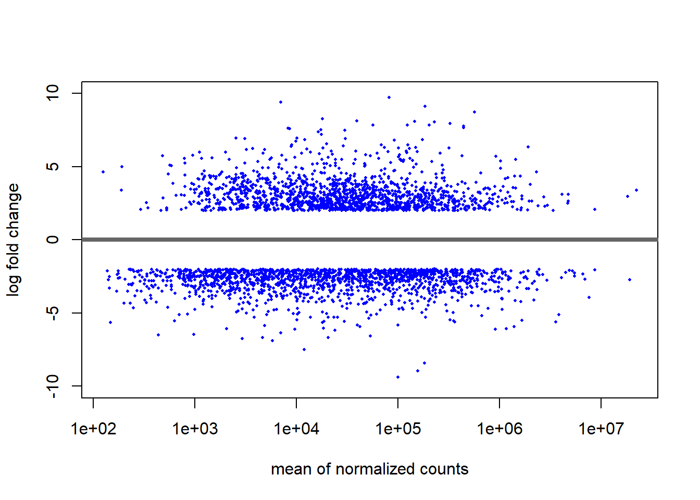
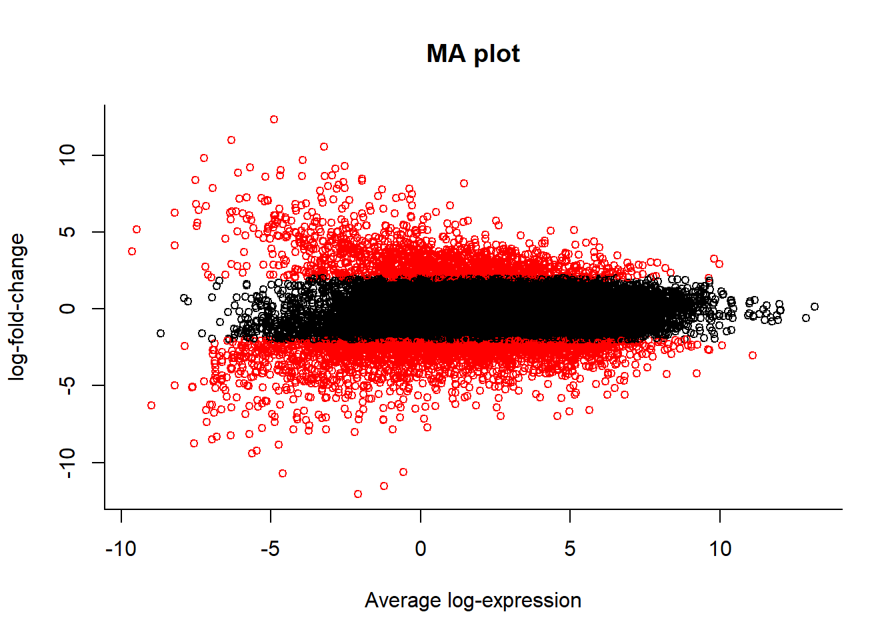
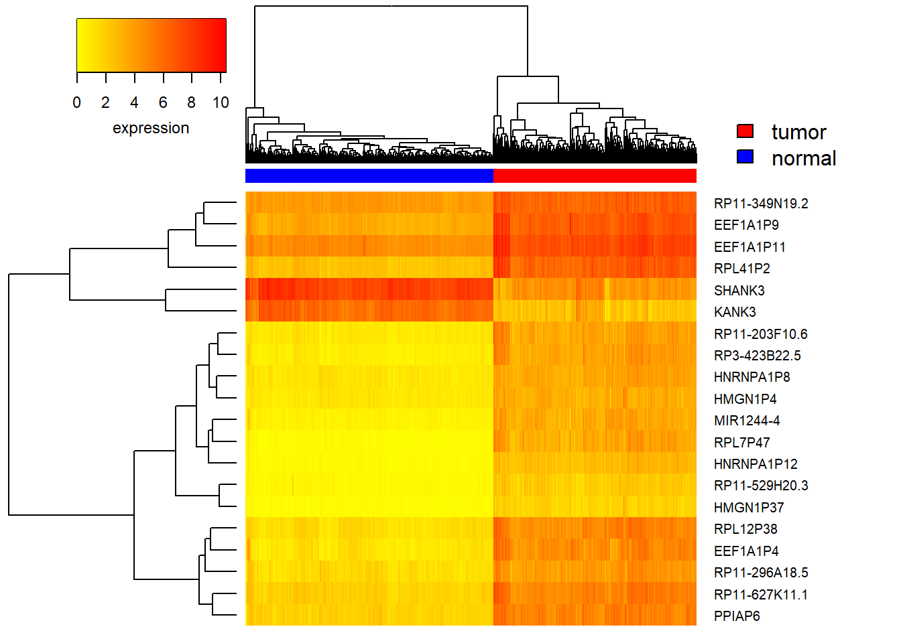
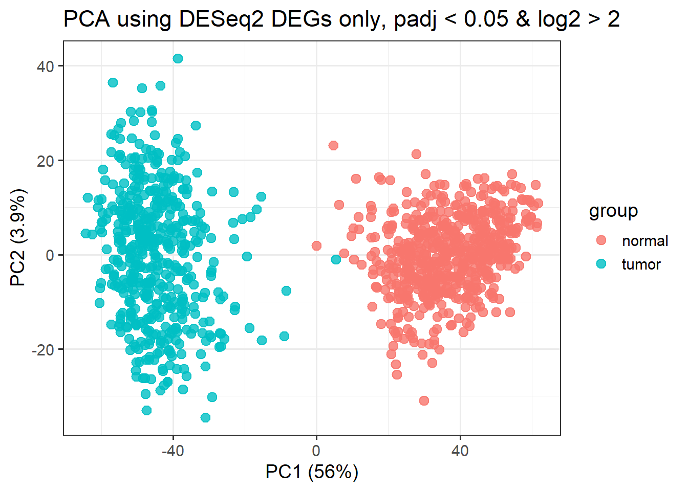
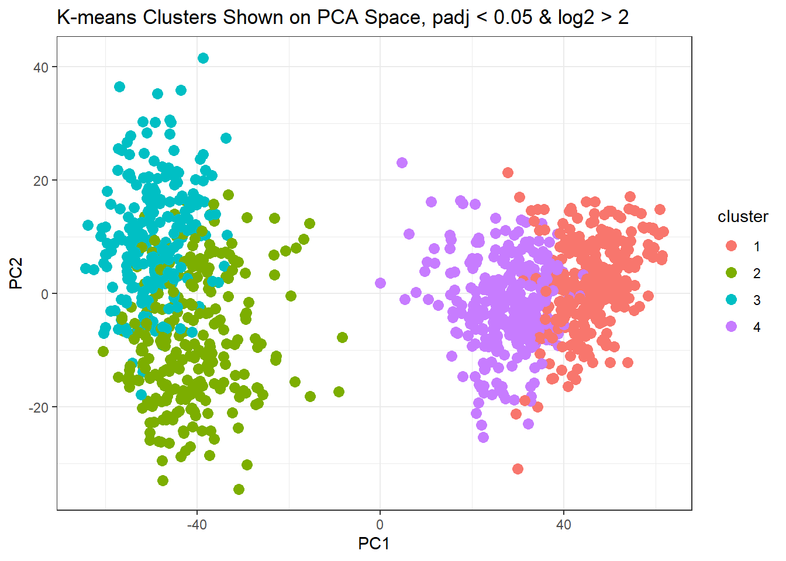
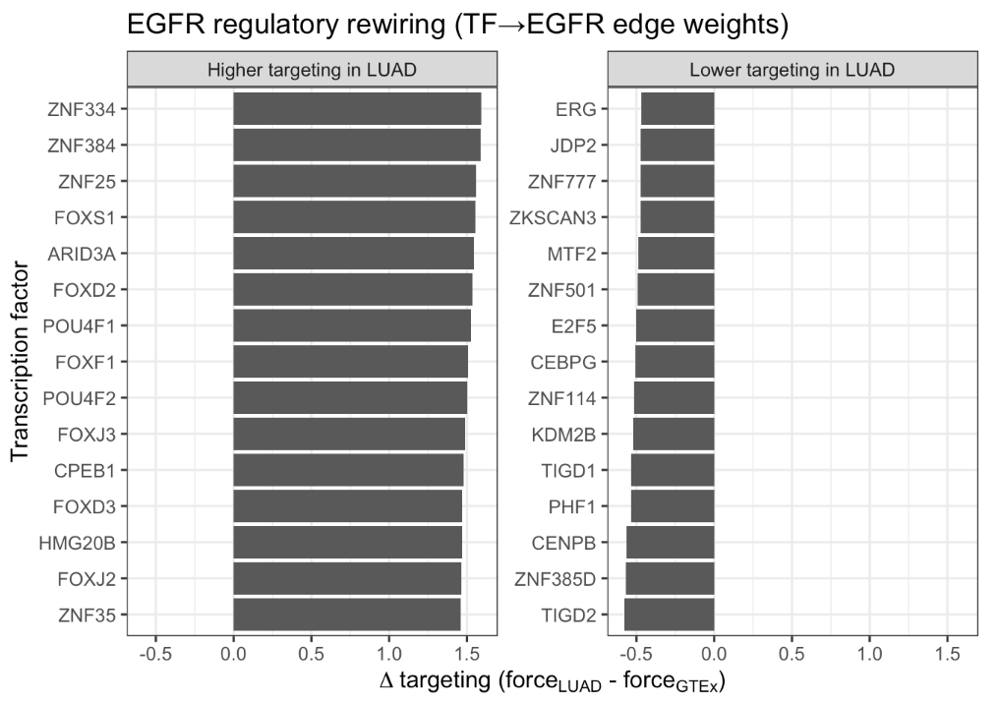
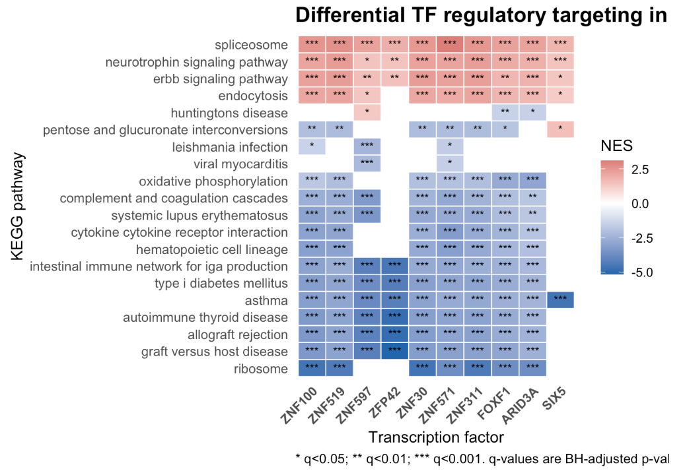
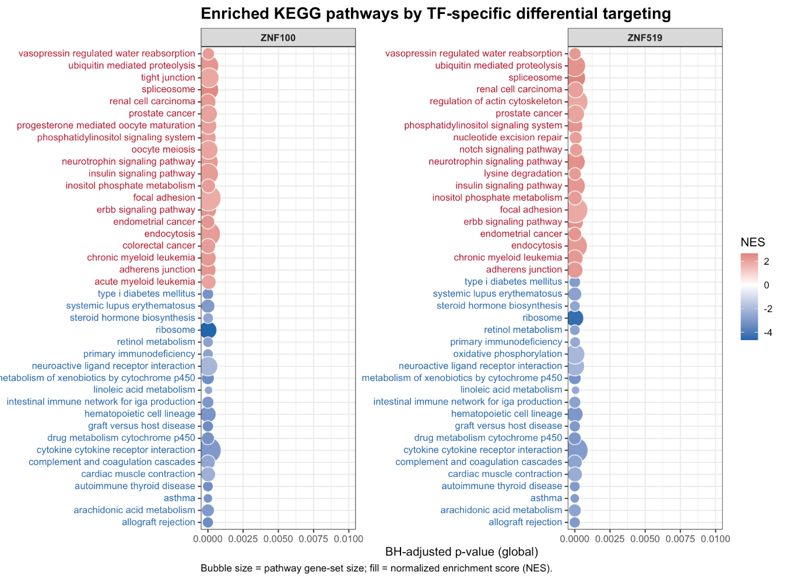

# **B. Differential Expression analysis**

Methods: 

We conducted differential expression analysis (DEA) using DESeq2, modeling gene expression as a function of disease status while adjusting for age (categories in 10-year increase) and sex (male vs. female) as covariates. Smoking status was not included in the regression model because this information was available only for tumor samples and not for controls. Individuals with missing age or sex information (n = 20) were excluded from the analysis. Resulting p-values were adjusted for multiple testing using the Benjamini–Hochberg false discovery rate (FDR) procedure. Shrinkage of log fold changes at low expression levels was applied to reduce variability among lowly expressed genes, while preserving strong signals among significantly DEGs. As a sensitivity analysis, we additionally performed DEA using limma-voom and compared the identified differentially expressed genes (DEGs) with those obtained from DESeq2.

Results:

After applying for shrinkage of log fold change and corrected for multiple testing, around 3,400 genes were found to be differentially expressed in DESeq2 that passed the threshold of adjusted p value < 0.05 and a log fold change > 2. This substantial number of genes show pronounced positive or negative log fold changes, distributed across a wide range of expression levels. Greater variability in log fold change is observed among genes with lower to moderate expression, whereas highly expressed genes exhibit more stable estimates. Overall, the symmetric distribution of up- and down-regulated genes suggests balanced differential expression between conditions.
```{r}

```

Both DESeq2 and limma-voom yielded broadly comparable results, with approximately 80% of DEGs identified by both methods. Among these shared DEGs, the Spearman correlation coefficient for log fold-change estimates was 0.98, indicating strong concordance between the two approaches.
```{r}

```

```{r}
knitr::include_graphics("figures/Venn.png")
```

The top 20 differentially expressed genes (DEGs) are shown below, with most exhibiting stronger up-regulation in tumor tissues compared with normal tissues. A majority of these genes were pseudogenes or long non-coding RNAs (lncRNAs). Based on functional annotation from GeneCards, several of the top DEGs are implicated in lung-related pathophysiology, including asthma (PPIAP6) and expiratory flow (HNRNPA1P8).
```{r}

```

# **C. PCA and clustering analysis**

Results: 

PCA based on DEGs (adjusted P < 0.05 and |log₂ fold change| > 2) demonstrated clear separation along the first two principal components, markedly improving discrimination compared with the global PCA. PC1 alone explained up to 56% of the total variance. Minimal overlap was observed between tumor and normal tissues, indicating strong underlying biological separation.

```{r}

```

To further characterize DEG expression patterns, unsupervised clustering was performed. Based on the within-cluster sum of squares (WSS) plot, four clusters were selected. Two clusters corresponded to tumor tissues and two to normal tissues, again demonstrating strong separation and distinct clustering between the two tissue types.

```{r}
knitr::include_graphics("figures/k-means.png")
```

```{r}

```

# **G. Deep Dive Into a Key Gene: EGFR**
# **1. Functional Overview and Disease Relevance (NCBI Gene Summary)**

The Epidermal Growth Factor Receptor (EGFR), also known as HER1 or ERBB1, is a transmembrane glycoprotein belonging to the protein kinase superfamily. EGFR functions as a receptor for ligands in the epidermal growth factor family. Upon ligand binding, EGFR undergoes receptor dimerization followed by tyrosine autophosphorylation, which activates multiple downstream signaling cascades that promote cell proliferation, survival, and differentiation.

Mutations and dysregulation of the EGFR gene are a well-established driver of non-small cell lung cancer (NSCLC), particularly lung adenocarcinoma (LUAD). Due to its central oncogenic role, EGFR represents one of the most important therapeutic targets in LUAD.

# **2. PANDA Network Analysis: Differential Regulatory Targeting**

Using PANDA network inference, we observed a dramatic rewiring of transcriptional regulation targeting EGFR in LUAD compared to normal GTEx lung tissue. Specifically, the regulatory connection strength (Force) directed toward EGFR shows substantial changes, indicating a fundamental shift in its transcriptional control program in cancer.

The table below summarizes transcription factors (TFs) with the largest absolute change in targeting strength toward EGFR:

| Rank | Transcription Factor (TF) | Force (LUAD) | Force (GTEx) | Δ Targeting (LUAD − GTEx) | Implication |
|-----:|---------------------------|--------------:|---------------:|---------------------------:|-------------|
| 1 | ZNF334 | 1.289 | -0.302 | +1.590 | Highly enhanced targeting in LUAD |
| 2 | ZNF384 | 1.310 | -0.280 | +1.590 | Highly enhanced targeting in LUAD |
| 3 | ZNF25  | 1.216 | -0.343 | +1.559 | Enhanced targeting in LUAD |
| 4 | FOXS1  | 1.293 | -0.260 | +1.554 | Enhanced targeting in LUAD |
| 5 | ARID3A | 1.024 | -0.524 | +1.547 | Enhanced targeting in LUAD |

These results demonstrate a concerted regulatory shift driven primarily by zinc finger proteins (ZNF334, ZNF384, ZNF25) and FOX family transcription factors. Their significantly increased targeting suggests that these TFs act as key drivers of aberrant EGFR upregulation in LUAD.

This pattern is summarized visually in Figure 1, where TFs are separated into increased versus decreased targeting of EGFR in LUAD.

```{r}

```


# **3. UCSC Genomic Context Supports Regulatory Rewiring (GRCh38 / hg38)**

To investigate the physical basis underlying the observed network rewiring, we examined the genomic context of the EGFR locus using the UCSC Genome Browser.

3.1 Genomic Features of EGFR

Chromosomal location: Chromosome 7p11.2

Gene structure: EGFR contains 32 exons

3.2 Regulatory Evidence from ENCODE

The most compelling evidence for enhanced regulatory activity comes from the ENCODE H3K27ac histone modification track, which marks active promoters and enhancers. The UCSC Genome Browser shows:

Strong, high-intensity H3K27ac peaks at the canonical promoter region (transcription start site, TSS)

Extended H3K27ac enrichment in upstream and intronic regulatory regions

3.3 Interpretation

The presence of robust H3K27ac signals indicates that the EGFR locus is surrounded by highly accessible and transcriptionally active regulatory elements. The increased PANDA targeting by TFs such as ZNF334 and FOXS1 is likely enabled by their enhanced binding to these active enhancer regions in LUAD. This provides a mechanistic explanation for the observed transcriptional rewiring and elevated EGFR expression.

# **4. Functional Consequences of Regulatory Rewiring (Secondary TF-Specific GSEA)**

To understand the broader functional impact of EGFR-targeting TFs, we performed TF-specific gene set enrichment analysis (GSEA) focusing on transcription factors such as ARID3A and FOXF1. A global overview of significant TF–pathway associations is shown in Figure 2, highlighting coordinated shifts in regulatory programs.
```{r}

```

4.1 Metabolic and Translational Reprogramming

Transcription factors showing high Δ targeting toward EGFR exhibited significantly reduced targeting of basal cellular pathways, including:

KEGG_RIBOSOME: NES ≈ −3.7; q-value < 1 × 10⁻²⁰

KEGG_OXIDATIVE_PHOSPHORYLATION: NES ≈ −2.9; q-value < 1 × 10⁻¹⁰

This pattern suggests a global regulatory shift away from cellular housekeeping functions toward pro-proliferative and oncogenic programs.

In addition to metabolic and translational pathways, multiple immune and inflammatory pathways (e.g., cytokine–cytokine receptor interaction, complement and coagulation cascades, and allograft rejection-related gene sets) show broadly negative NES values across rewired TFs. This indicates a coordinated reduction of immune and homeostatic regulatory targeting in LUAD. Conversely, positive enrichment of ERBB signaling and endocytosis-related pathways is consistent with a shift toward receptor tyrosine kinase–associated programs, aligning with enhanced EGFR regulatory targeting in the tumor network.

4.2 Signal Maintenance and Protein Stability

Notably, the transcription factor FOXF1 displayed significantly enhanced targeting of the KEGG_UBIQUITIN_MEDIATED_PROTEOLYSIS pathway (NES ≈ +2.25; q-value ≈ 4.8 × 10⁻⁹).

Ubiquitination plays a critical role in regulating receptor tyrosine kinases, including EGFR, by controlling protein degradation and signal termination. The rewired regulation of this pathway suggests a coordinated mechanism that may modulate EGFR stability or prolong signaling duration, further promoting uncontrolled cell growth.

To make these pathway shifts more concrete, Figure 3 summarizes the most significant enriched KEGG pathways for representative highly rewired transcription factors.
```{r}

```

# **5.Conclusion**

By integrating network inference, functional pathway analysis, and genomic context, we provide a cohesive explanation for the role of EGFR in LUAD pathogenesis:

Direct Regulatory Drivers:
A specific subset of transcription factors (e.g., ZNF334, ZNF384) shows dramatically increased regulatory influence on EGFR in LUAD.

Genomic Mechanism:
This enhanced influence is physically supported by H3K27ac-marked active enhancers surrounding the EGFR locus, enabling stronger transcription factor binding and transcriptional activation.

Coordinated Oncogenic Program:
The same transcription factors that upregulate EGFR also globally rewire pathways related to protein degradation, metabolism, and translation, reshaping the cellular environment to sustain malignancy.

Overall, EGFR contributes to LUAD not only through its intrinsic oncogenic signaling but also as a central hub within a massively reorganized transcriptional regulatory network.

Limitations:
DEA revealed a system-wide shift in gene expression between tumor (TCGA-LUAD) and normal (GTEx lung) samples. However, this pattern likely reflects systematic differences between data sources—such as technical, procedural, or cohort-level variation—rather than purely biological differences. Because the dataset indicator (TCGA vs. GTEx) is perfectly colinear with case status (tumor vs. normal), batch effect and phenotype cannot be disentangled. For this reason, both DESeq2 and limma-voom were run using raw counts rather than batch-corrected expression values. Correcting for dataset batch would have removed the tumor–normal contrast entirely. 